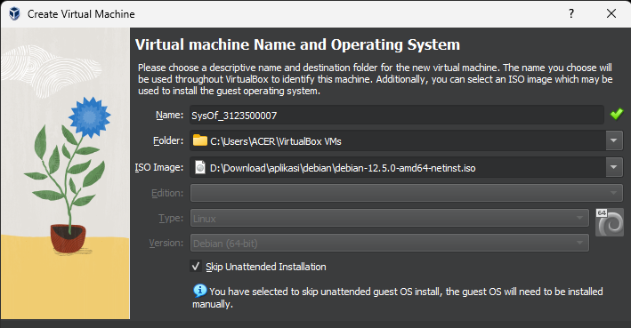

# 1. Sebutkan dan jelaskan proses booting!
Proses booting adalah serangkaian langkah yang dilakukan oleh komputer ketika dinyalakan untuk mempersiapkan sistem agar siap digunakan. Proses ini meliputi:

1. *Menghidupkan Komputer*: Saat tombol daya ditekan, sumber daya listrik dialirkan ke komputer.
 
2. *Tes Awal (POST)*: Komputer melakukan Power-On Self-Test (POST) untuk memeriksa perangkat keras utama seperti RAM, prosesor, dan kartu grafis. Tujuannya adalah untuk memastikan bahwa semua perangkat keras berfungsi dengan baik sebelum memuat sistem operasi.

3. *Inisialisasi Perangkat Keras*: Setelah POST, komputer menginisialisasi perangkat keras seperti hard drive, keyboard, mouse, dan perangkat lainnya. Ini melibatkan pengenalan perangkat keras, pemuatan driver yang diperlukan, dan persiapan perangkat untuk digunakan.

4. *Pencarian Sektor Boot*: Komputer mencari sektor boot, area khusus di hard drive yang berisi instruksi awal untuk memuat sistem operasi.

5. *Memuat Sistem Operasi*: Setelah sektor boot ditemukan, sistem operasi dimuat ke dalam memori utama (RAM). Sistem operasi kemudian mengambil alih kendali dan mulai menjalankan program-program yang diperlukan untuk mengoperasikan komputer.

Proses booting memungkinkan komputer untuk memulai operasi normalnya dan siap digunakan oleh pengguna.

# 2. Bagaimana cara install Debian 12 di Virtualbox

1.Buka virtual box dan klik tombol new

2.Beri nama untuk project nya dan pilih iso debian yang ada di storage dan checklist kolom skip

3.Atur berapa ram yang ingin di gunakan(sesuaikan dengan ram device) dan core cpu

