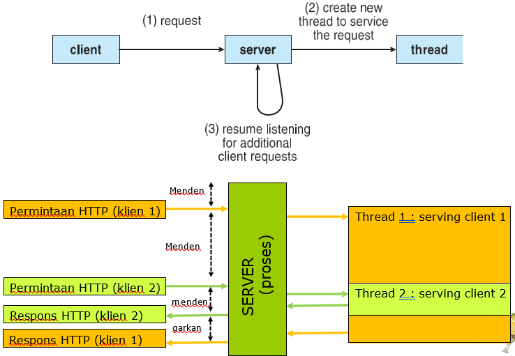
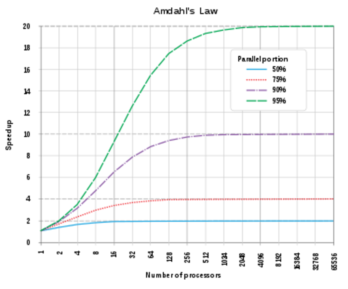
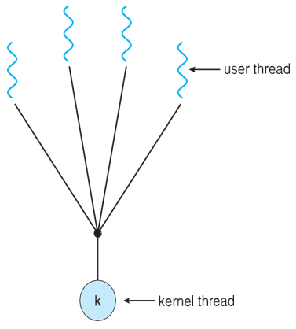
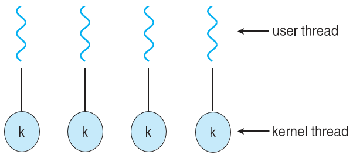
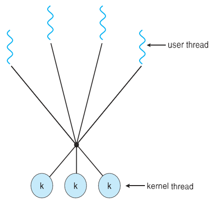
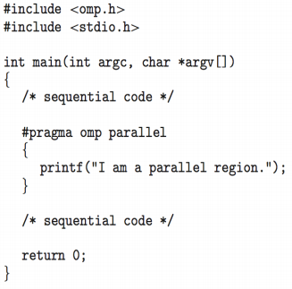
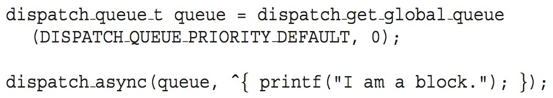
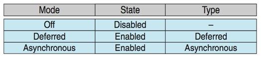
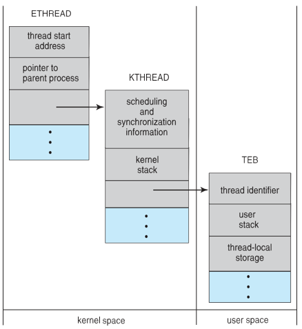
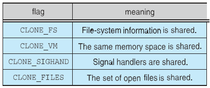

## Daftar Isi
- [Esai Threads](#esai-threads)
- [Soal dan Jawaban Seputar Materi Threads](#soal-dan-jawaban-seputar-materi-threads)
- [Referensi](#referensi)

## Esai Threads

### Multithread Server Architecture 



#### Benefits

- Responsiveness
    - dapat memungkinkan eksekusi berlanjut jika sebagian proses diblokir, sangat penting untuk antarmuka pengguna
    - Multithreading dalam aplikasi interaktif memungkinkan program untuk tetap berjalan walaupun bagian dari program tersebut sedang diblokir / terhalang atau sedang menjalankan operasi yang memakan waktu. Ini meningkatkan responsivitas terhadap pengguna. Di lingkungan tanpa multithreading, server hanya bisa melayani satu permintaan pada satu waktu. Ini menyebabkan pengguna lain harus menunggu tanpa alasan. Pendekatan yang lebih baik adalah meneruskan permintaan ke thread pekerja dan terus mendengarkan port untuk permintaan lainnya.
- Resource Sharing
    - thread berbagi sumber daya proses, lebih mudah daripada memori bersama atau pengiriman pesan
    - proses dapat berbagi resources hanya melalui teknik seperti
        - Message passing
        - shared memory
    - dimana teknik-teknik tersebut harus diatur secara eksplisit oleh programmer. Benefit dari berbagi kode dan data adalah memungkinkan aplikasi memiliki beberapa rangkaian aktivitas dalam ruang address yang sama.
- Economy
    - lebih murah daripada pembuatan proses, pergantian thread lebih rendah overhead daripada context switch
    - mengalokasikan memory dan resources untuk pembuatan proses itu adalah pekerjaan yang mahal dalam segi waktu dan ruang, sehingga lebih murah dan ekonomis untuk membuat dan context switch threads.
- Scalability
    - proses dapat memanfaatkan arsitektur multiprosesor
    - Proses single threaded hanya dapat berjalan pada satu prosesor terlepas dari berapa banyak prosesor yang tersedia. Multi-threading pada multiple CPU meningkatkan paralelisme.

### Multicore Programming

**Multicore** atau sistem **multiprocessor** memberikan tekanan pada pemrogram, tantangannya meliputi:

- **Dividing activities**

    Tantangannya adalah untuk memeriksa tugas dengan benar untuk menemukan area yang dapat dibagi menjadi sub-tugas terpisah, yang dapat dijalankan secara paralel pada setiap prosesor untuk menggunakan sepenuhnya beberapa inti komputasi.
- **Balance**

    Dalam pemrograman sistem multicore, tugas harus dibagi menjadi sub-tugas dengan jumlah pekerjaan yang sama untuk meningkatkan kinerja. Distribusi pekerjaan yang tidak merata di antara sub-tugas mungkin tidak akan meningkatkan kinerja dibandingkan dengan sistem single-core.
- **Data splitting**

    Sama seperti tugas dibagi menjadi sub-tugas yang lebih kecil, data yang diakses dan dimanipulasi oleh tugas tersebut juga harus dibagi untuk dijalankan pada inti yang berbeda sehingga data dapat dengan mudah diakses oleh setiap sub-tugas.
- **Data dependency**

    Karena berbagai sub-tugas kecil berjalan di berbagai inti, mungkin saja satu sub-tugas bergantung pada data dari sub-tugas lainnya. Jadi data perlu diperiksa dengan baik sehingga eksekusi tugas keseluruhan disinkronkan.
- **Testing and debugging**

    Ketika berbagai sub-tugas yang lebih kecil sedang dieksekusi secara paralel, maka pengujian dan debugging pada tugas-tugas konkuren seperti itu lebih sulit daripada pengujian dan debugging aplikasi berbasis single threaded.

***Parallelism*** menyiratkan suatu sistem dapat melakukan lebih dari satu tugas secara bersamaan

- Paralelisme dalam aplikasi melibatkan pembagian tugas menjadi sub-tugas yang lebih kecil yang diproses seolah-olah secara bersamaan untuk meningkatkan throughput dan kecepatan komputasi. Ini memungkinkan CPU sekuensial tunggal untuk melakukan beberapa tugas "seolah-olah" pada saat yang sama.
- Paralelisme dan konkurensi dalam pengolahan tugas yang tumpang tindih untuk meningkatkan kecepatan, dengan paralelisme berfokus pada tumpang tindih tugas CPU dan input-output dalam dan antara proses, dan konkurensi meningkatkan kecepatan dengan menumpang tindihkan aktivitas input-output dari satu proses dengan proses CPU dari yang lainnya.

***Concurrency*** mendukung lebih dari satu kemajuan pembuatan tugas.
Prosesor / inti tunggal, penjadwalan menyediakan konkurensi.

- Concurrency merujuk pada suatu aplikasi yang memproses beberapa tugas secara bersamaan, menggunakan satu unit pemrosesan untuk mengurangi waktu respons sistem. Ini menciptakan ilusi paralelisme, karena tugas-tugas tidak diproses secara paralel, tetapi beberapa tugas diproses dalam aplikasi pada saat yang sama.
- Concurrency dicapai melalui operasi interleave proses pada Central Processing Unit (CPU) atau dengan kata lain dengan context switching. itulah alasan mengapa ini seperti pemrosesan paralel. Ini meningkatkan jumlah pekerjaan yang selesai pada suatu waktu.

Jenis-jenis paralelisme

- **Data Paralelism** – mendistribusikan subset dari data yang sama ke beberapa inti, operasi yang sama di setiap inti
- **Task Paralelism** – mendistribusikan thread ke inti, setiap thread melakukan operasi unik

Seiring bertambahnya jumlah thread, dukungan arsitektur untuk threading juga bertambah

- CPU memiliki inti serta ***hardware thread***
- Pertimbangkan Oracle SPARC T4 dengan 8 inti, dan 8 thread perangkat keras per inti

### Amdahl Law

Hukum Amdahl adalah rumus yang digunakan untuk menghitung peningkatan kecepatan maksimum yang dapat dicapai sistem dengan meningkatkan bagian tertentu. Peningkatan kinerja suatu sistem akan dibatasi oleh bagian sistem yang tidak ditingkatkan. Misalnya, peningkatan kinerja keseluruhan komputer dengan prosesor yang lebih cepat akan dibatasi oleh kecepatan RAM. Rumus Hukum Amdahl adalah: Peningkatan Kecepatan = 1 - (Waktu yang Tidak Dapat Ditingkatkan / Waktu Total).

Dalam rumus ini, "Waktu yang Tidak Dapat Ditingkatkan" adalah waktu yang dibutuhkan untuk menyelesaikan bagian sistem yang tidak dapat ditingkatkan. "Waktu Total" adalah waktu yang dibutuhkan untuk menyelesaikan seluruh tugas.

Hukum Amdahl adalah alat yang berharga untuk memahami batasan kinerja sistem. Hal ini dapat digunakan untuk membuat keputusan tentang cara terbaik untuk meningkatkan kinerja sistem.



### User Threads dan Kernel Threads

**User threads** - manajemen dilakukan oleh library thread tingkat pengguna

Tiga library thread utama:

- POSIX **Pthreads**
- Windows threads
- Java threads

**Kernel threads** - Didukung oleh Kernel

Contoh - hampir semua sistem operasi tujuan umum, termasuk:

- Windows
- Solaris
- Linux
- Tru64 UNIX
- Mac OS X

| No. | Parameter | Thread Tingkat Pengguna | Thread Tingkat Kernel |
| --- | --- | --- | --- |
| 1. | Diterapkan oleh | Thread pengguna diterapkan oleh pengguna. | Thread kernel diterapkan oleh Sistem Operasi (OS). |
| 2. | Mengenali | Sistem operasi tidak mengenali thread tingkat pengguna. | Thread kernel diakui oleh Sistem Operasi. |
| 3. | Implementasi | Implementasi thread pengguna mudah. | Implementasi thread tingkat kernel rumit. |
| 4. | Waktu pergantian konteks | Waktu pergantian konteks lebih sedikit. | Waktu pergantian konteks lebih banyak. |
| 5. | Dukungan perangkat keras | Pergantian konteks tidak memerlukan dukungan perangkat keras. | Dukungan perangkat keras diperlukan. |
| 6. | Operasi blokir | Jika satu thread tingkat pengguna melakukan operasi blokir maka seluruh proses akan diblokir. | Jika satu thread kernel melakukan operasi blokir maka thread lain bisa melanjutkan eksekusi. |
| 7. | Multithreading | Aplikasi multithread tidak bisa memanfaatkan multiprocessing. | Kernel bisa multithread. |
| 8. | Pembuatan dan Manajemen | Thread tingkat pengguna bisa dibuat dan dikelola lebih cepat. | Thread tingkat kernel membutuhkan lebih banyak waktu untuk membuat dan mengelola. |
| 9. | Sistem Operasi | Setiap sistem operasi dapat mendukung thread tingkat pengguna. | Thread tingkat kernel spesifik sistem operasi. |
| 10. | Manajemen Thread | Library thread berisi kode untuk pembuatan thread, pengiriman pesan, penjadwalan thread, transfer data, dan penghancuran thread. | Kode aplikasi tidak mengandung kode manajemen thread. Ini hanyalah API ke mode kernel. Sistem operasi Windows memanfaatkan fitur ini. |
| 11. | Contoh | Contoh: Thread Java, thread POSIX. | Contoh: Window Solaris. |
| 12. | Keuntungan | Sederhana dan cepat untuk membuat, Dapat berjalan di setiap sistem operasi, Berkinerja lebih baik daripada thread kernel karena mereka tidak perlu melakukan panggilan sistem untuk membuat thread, Pergantian antara thread tidak memerlukan hak istimewa mode kernel. | Penjadwalan banyak thread yang termasuk dalam proses yang sama pada prosesor yang berbeda adalah mungkin,  Multithreading bisa ada di rutin kernel, Ketika thread di tingkat kernel dihentikan, kernel dapat menjadwalkan thread lain untuk proses yang sama. |
| 13. | Kerugian | Aplikasi multithread pada thread tingkat pengguna tidak dapat mendapatkan manfaat dari multiprocessing, Jika satu thread tingkat pengguna melakukan operasi blokir seluruh proses dihentikan, Mengalihkan kontrol dalam proses dari satu thread ke thread lain membutuhkan mode beralih ke mode kernel,  Thread tingkat kernel membutuhkan lebih banyak waktu untuk membuat dan mengelola daripada thread tingkat pengguna. | Jika satu thread jatuh, tidak selalu mempengaruhi yang lain. |
| 14. | Manajemen memori | Dalam thread tingkat pengguna, setiap thread memiliki stack sendiri, tetapi mereka berbagi ruang alamat yang sama. | Thread tingkat kernel memiliki stack mereka sendiri dan ruang alamat mereka sendiri, jadi mereka lebih terisolasi satu sama lain. |
| 15. | Toleransi kesalahan | Thread tingkat pengguna kurang toleran terhadap kesalahan daripada thread tingkat kernel. Jika thread tingkat pengguna jatuh, itu bisa menjatuhkan seluruh proses. | Thread tingkat kernel dapat dikelola secara independen, jadi jika satu thread jatuh, itu tidak selalu mempengaruhi yang lain. |
| 16. | Pemanfaatan sumber daya | Thread tingkat pengguna tidak memanfaatkan sepenuhnya sumber daya sistem, karena mereka tidak memiliki akses langsung ke fitur tingkat sistem seperti operasi I/O. | Thread tingkat kernel dapat mengakses fitur tingkat sistem seperti operasi I/O, jadi mereka dapat memanfaatkan sepenuhnya sumber daya sistem. |
| 17. | Portabilitas | Thread tingkat pengguna lebih portabel daripada thread tingkat kernel. | Thread tingkat kernel kurang portabel daripada thread tingkat pengguna. |

### Multithreading Models

1. Many-to-One
2. One-to-One
3. Many-to-Many

#### Many-to-One

Dalam model ini, kami memiliki beberapa thread pengguna yang dipetakan ke satu thread kernel. Dalam model ini ketika thread pengguna membuat panggilan sistem pemblokiran seluruh blok proses. Karena kami hanya memiliki satu thread kernel dan hanya satu thread pengguna yang dapat mengakses kernel pada satu waktu, maka beberapa thread tidak dapat mengakses multiprosesor secara bersamaan. 

- Banyak thread tingkat pengguna yang dipetakan ke thread kernel tunggal
- Satu pemblokiran thread menyebabkan semua diblokir 
- Beberapa thread mungkin tidak berjalan secara paralel pada sistem muticore karena hanya satu yang mungkin berada di kernel pada suatu waktu
- Beberapa sistem saat ini menggunakan model ini 

Contoh : 
1. **Solaris Green Threads**
2. **GNU Portable Threads**



#### One-to-One

Dalam model ini, hubungan satu lawan satu antara kernel dan thread pengguna. Dalam model ini, beberapa thread dapat berjalan pada banyak prosesor. Masalah dengan model ini adalah pembuatan thread pengguna memerlukan thread kernel yang sesuai. 

Karena setiap thread pengguna terhubung ke kernel yang berbeda, jika ada thread pengguna yang melakukan panggilan sistem pemblokiran, thread pengguna lainnya tidak akan diblokir.

- Setiap thread tingkat pengguna memetakan ke thread kernel
- Membuat thread tingkat pengguna membuat thread kernel
- Lebih banyak konkurensi daripada many-to-one
- Jumlah thread per proses terkadang
dibatasi karena overhead

Contoh : 
1. Windows
2. Linux
3. Solaris 9 and later



#### Many-to-Many

Dalam model ini, kami memiliki beberapa thread pengguna yang multipleks ke jumlah thread tingkat kernel yang sama atau lebih sedikit. Jumlah thread tingkat kernel khusus untuk mesin, keuntungan dari model ini adalah jika thread pengguna diblokir kita dapat menjadwalkan thread pengguna lain ke thread kernel lain. Dengan demikian, Sistem tidak memblokir jika thread tertentu diblokir. 

- Memungkinkan banyak thread tingkat pengguna dipetakan ke banyak thread kernel
- Memungkinkan sistem operasi untuk membuat thread kernel dalam jumlah yang cukup
- Solaris sebelum versi 9
- Windows dengan paket ThreadFiber 



### Threads Library

**Thread LIbrary** menyediakan programmer dengan API untuk membuat dan mengelola thread

Dua cara utama untuk mengimplementasikan:

- Library sepenuhnya di ruang pengguna
- Library tingkat kernel yang didukung oleh OS

Thread library, yang membantu dalam membuat dan mengelola thread, dapat diimplementasikan dengan dua cara: sepenuhnya di ruang pengguna tanpa dukungan kernel, menghasilkan panggilan fungsi lokal, atau sebagai perpustakaan tingkat kernel yang didukung oleh sistem operasi, biasanya menghasilkan panggilan sistem ke kernel.

Tiga thread library utama yang digunakan saat ini adalah: POSIX Pthreads, Windows, dan Java. Pthreads, ekstensi thread dari standar POSIX, mungkin disediakan sebagai perpustakaan tingkat pengguna atau perpustakaan tingkat kernel. Perpustakaan thread Windows adalah perpustakaan tingkat kernel yang tersedia di sistem Windows. API thread Java memungkinkan thread dibuat dan dikelola langsung di program Java.

### Pthreads

- Dapat disediakan baik sebagai level pengguna atau level kernel
- Sebuah API standar POSIX (IEEE 1003.1c) untuk pembuatan dan sinkronisasi thread
- ***Spesifikasi***, bukan ***implementasi***
- API menentukan perilaku dari library thread, implementasi tergantung pada pengembangan library
- Umum dalam sistem operasi UNIX (Solaris, Linux, Mac OS X)

POSIX Threads adalah cara untuk membuat dan mengelola utas (threads) dalam sistem operasi yang sesuai dengan standar POSIX (Portable Operating System Interface). Utas adalah unit eksekusi independen yang dapat berjalan secara bersamaan dalam satu proses. Hal ini memungkinkan program untuk dibagi menjadi beberapa tugas yang dapat dijalankan secara bersamaan, sehingga meningkatkan kinerja pada sistem multiprosesor.

Berikut adalah beberapa keunggulan menggunakan POSIX Threads:

- **Meningkatkan kinerja:** Dengan membagi program menjadi beberapa utas, tugas-tugas dapat dijalankan secara bersamaan pada prosesor yang berbeda, sehingga meningkatkan kinerja program secara keseluruhan.
- **Peningkatan skalabilitas:** Program yang menggunakan POSIX Threads dapat dijalankan pada sistem dengan jumlah prosesor yang berbeda tanpa perlu dimodifikasi.
- **Peningkatan responsivitas:** Utas dapat diprioritaskan, sehingga tugas-tugas penting dapat dijalankan lebih cepat daripada tugas-tugas yang kurang penting.
- **Penggunaan memori yang lebih efisien:** Utas berbagi ruang memori yang sama dengan proses tempat mereka dibuat, sehingga mereka tidak memerlukan memori tambahan sebanyak proses.

POSIX Threads diimplementasikan menggunakan pustaka fungsi yang dapat dipanggil dari program C atau C++. Pustaka ini menyediakan fungsi untuk membuat dan mengelola utas, menyinkronkan akses ke data bersama, dan berkomunikasi antar utas.

Berikut adalah beberapa contoh fungsi POSIX Threads yang umum digunakan:

- `pthread_create()`: Membuat utas baru.
- `pthread_join()`: Menunggu utas lain untuk selesai.
- `pthread_mutex_lock()`: Mengunci mutex untuk mencegah akses simultan ke data bersama.
- `pthread_mutex_unlock()`: Membuka kunci mutex.
- `pthread_cond_signal()`: Menandakan kondisi yang telah dipenuhi.
- `pthread_cond_wait()`: Menunggu kondisi yang dipenuhi.

POSIX Threads adalah alat yang ampuh untuk meningkatkan kinerja dan skalabilitas program. Namun, penting untuk menggunakannya dengan hati-hati untuk menghindari kondisi balapan dan masalah sinkronisasi lainnya.

### Threads Java

- Java thread dikelola oleh JVM
- Biasanya diimplementasikan menggunakan model thread yang disediakan oleh OS yang mendasarinya
- Java thread dapat dibuat oleh:

    ```
    public interface Runnable
    {
        public abstract void run();
    }
    ```

Threads memungkinkan program beroperasi lebih efisien dengan melakukan banyak hal secara bersamaan.

Threads dapat digunakan untuk melakukan tugas-tugas yang rumit di latar belakang tanpa mengganggu program utama.

Thread Java adalah unit eksekusi program yang ringan dan independen. Thread memungkinkan program multithreaded untuk menjalankan beberapa tugas secara bersamaan, sehingga meningkatkan efisiensi program. Thread juga lebih ringan daripada proses, sehingga tidak menggunakan banyak memori. Java menyediakan beberapa cara untuk membuat dan mengelola thread.

Berikut adalah beberapa poin penting tentang thread Java:

- **Independensi:** Setiap thread memiliki tumpukan eksekusi dan ruang memori sendiri, sehingga dapat berjalan secara independen satu sama lain.
- **Kooperasi:** Thread dapat berkomunikasi dan bertukar data satu sama lain melalui objek bersama.
- **Sinkronisasi:** Mekanisme sinkronisasi seperti kunci dan semaphore digunakan untuk mengontrol akses ke objek bersama dan mencegah konflik antar thread.

Thread Java memiliki banyak manfaat, termasuk:

- **Peningkatan kinerja:** Program multithreaded dapat memanfaatkan beberapa prosesor secara bersamaan, sehingga meningkatkan kinerja secara keseluruhan.
- **Peningkatan respons:** Thread dapat digunakan untuk menangani tugas-tugas yang tidak memblokir, seperti input/output, sehingga meningkatkan respons program.
- **Pemrograman yang lebih mudah:** Thread dapat digunakan untuk menyederhanakan pemrograman tugas-tugas yang kompleks dengan membaginya menjadi subtugas yang lebih kecil dan dapat dikelola.

Jika Anda ingin mempelajari lebih lanjut tentang thread Java, saya sarankan untuk membaca artikel lengkap di GeeksforGeeks. Artikel ini membahas berbagai topik terkait thread Java, termasuk cara membuat dan mengelola thread, mekanisme sinkronisasi, dan common pitfalls.

### Implicit Threading

implicit threading pada dasarnya adalah penggunaan pustaka atau dukungan bahasa lain untuk menyembunyikan manajemen thread. Pustaka implicit threading yang paling umum adalah OpenMP, dalam konteks C.

- Semakin populer seiring bertambahnya jumlah thread, ketepatan program lebih sulit dengan thread eksplisit
- Pembuatan dan pengelolaan thread dilakukan oleh kompiler dan run-time libraries daripada programmer
- Tiga metode yang dieksplorasi
    - Thread Pools
    - OpenMP
    - Grand Central Dispatch
- Metode lain termasuk Microsoft Threading Building Blocks (TBB), paket **java.util.concurrent**

### Thread Pools

Kumpulan utas (thread pool) adalah sekelompok utas yang menunggu untuk ditugaskan tugas. Hal ini meningkatkan kinerja program dengan menggunakan kembali utas yang sudah ada alih-alih membuat utas baru untuk setiap tugas. Hal ini dapat mengurangi overhead dan meningkatkan stabilitas sistem. Jumlah utas dalam kumpulan dapat disesuaikan berdasarkan beban kerja.

- Buat sejumlah thread dalam sebuah pool di mana mereka menunggu untuk dikerjakan
- Keuntungan:
    - Biasanya sedikit lebih cepat untuk melayani permintaan dengan thread yang sudah ada daripada membuat thread baru
    - Memungkinkan jumlah thread dalam aplikasi terikat dengan ukuran pool
    - Memisahkan tugas yang akan dilakukan dari mekanisme pembuatan tugas memungkinkan strategi yang berbeda untuk menjalankan tugas
        - yaitu Tugas dapat dijadwalkan untuk dijalankan secara berkala
- Secara berkala Windows API supports thread pools:

    ```
    DWORD WINAPI PoolFunction (AVOID Param) {
        /* 
        * this function runs as a separate thread.
        */
    }
    ```

### OpenMP

OpenMP adalah sekumpulan arahan kompiler serta API untuk program yang ditulis dalam bahasa C, C++, atau FORTRAN yang menyediakan dukungan untuk pemrograman paralel dalam lingkungan memori bersama. OpenMP mengidentifikasi wilayah paralel sebagai blok kode yang dapat berjalan secara paralel. Pengembang aplikasi memasukkan arahan kompiler ke dalam kode mereka di wilayah paralel, dan arahan ini menginstruksikan pustaka run-time OpenMP untuk mengeksekusi wilayah tersebut secara paralel.

- Set arahan compiler dan API untuk C, C ++, FORTRAN
- Menyediakan dukungan untuk pemrograman paralel di lingkungan shared-memory 
- Mengidentifikasi **wilayah paralel** – blok kode yang dapat berjalan secara paralel

    

    


### Grand Central Dispatch

- Teknologi Apple untuk sistem operasi Mac OS X dan iOS
- Ekstensi untuk bahasa C, C++, API, dan pustaka run-time
- Memungkinkan identifikasi bagian paralel
- Mengelola sebagian besar detail penguliran
- Blok berada dalam “^{ }” - **ˆ{ printf(“Saya adalah sebuah blok”); }**
- Blok ditempatkan dalam antrian pengiriman
    - Ditetapkan ke thread yang tersedia di kumpulan thread saat dihapus dari antrian
- Dua jenis antrian pengiriman:
    - serial - blok dihapus dalam urutan FIFO, antrian per proses, disebut **antrian utama**
        - Pemrogram dapat membuat antrian serial tambahan dalam program
    - bersamaan - dihapus dalam urutan FIFO tetapi beberapa dapat dihapus sekaligus
        - Tiga antrian di seluruh sistem dengan prioritas rendah, default, tinggi

            

### Threading Issues

#### Semantics of fork() and exec() system calls

fork() membuat sebuah proses baru yang merupakan salinan dari proses yang dipanggil. Ini termasuk menyalin semua thread dalam sebuah program multi-threaded pada beberapa sistem UNIX. Ada dua versi fork() yang mengontrol berapa banyak thread yang disalin. fork dapat menduplikasi semua thread dari proses induk ke proses anak atau hanya thread yang dipanggil oleh proses induk.

exec() menggantikan seluruh proses dengan program baru yang ditentukan dalam argumen-argumennya.

Karena exec() menggantikan proses, maka tidak perlu melakukan fork() dan menyalin semua thread jika exec() dipanggil setelahnya. Dalam kasus ini, versi fork() yang hanya menyalin thread yang dipanggil akan lebih efisien.

#### Signal Handling

- Sinyal **signal** digunakan pada sistem UNIX untuk memberitahukan suatu proses bahwa suatu peristiwa tertentu telah terjadi.
- Sebuah **penangan sinyal** digunakan untuk memproses sinyal
    - Sinyal dihasilkan oleh suatu peristiwa tertentu
    - Sinyal dikirimkan ke sebuah proses
    - Sinyal ditangani oleh salah satu dari dua penangan sinyal:
        - Default
        - Ditentukan pengguna
- Setiap sinyal memiliki **Pengendali default** yang dijalankan kernel saat menangani sinyal
- **Penanganan sinyal yang ditentukan pengguna** dapat menggantikan default
- Untuk single-threaded, sinyal dikirim ke proses

Ke mana sinyal harus dikirimkan untuk multi-threaded?

- Mengirimkan sinyal ke utas yang menggunakan sinyal tersebut
- Mengirimkan sinyal ke setiap utas dalam proses
- Mengirimkan sinyal ke utas tertentu dalam proses
- Menetapkan thread tertentu untuk menerima semua sinyal untuk proses

Dalam program multithreaded, sinyal dapat menjadi rumit. Tidak seperti single-threaded apps di mana sinyal menuju ke seluruh proses, multithreading membuat target menjadi tidak jelas.

Ada dua jenis sinyal:

- Synchronous: Dikirim ke thread yang menyebabkannya (seperti kesalahan program).
- Asynchronous: Dapat datang secara tidak terduga dari luar program (seperti sinyal penghentian).

Sinyal Asynchronous merupakan tantangan dalam multithreading karena tidak jelas thread mana yang harus menerimanya. Pada sistem Unix, thread dapat menentukan sinyal mana yang mereka inginkan, tetapi OS pada akhirnya memutuskan pengirimannya.

Windows menggunakan Panggilan Prosedur Asinkron (APC) sebagai pengganti sinyal. Tidak seperti Unix di mana sebuah thread memilih sinyalnya, semua thread dalam proses Windows dapat menerima APC.

### Thread Cancellation

- Menghentikan thread sebelum selesai dikerjakan
- Thread yang akan dibatalkan adalah **thread target**

Dua pendekatan umum:

- **Pembatalan asynchronous** mengakhiri thread target dengan segera
- **Deffered cancellation** memungkinkan thread target untuk memeriksa secara berkala apakah harus dibatalkan

    Kode Pthread untuk membuat dan membatalkan thread:

    ```
    pthread_t tid;

    /* create the thread */
    pthread_create (&tid, 0, worker, NULL);

    ...

    /* cancel the thread */
    pthread_cancel (tid);
    ```

- Meminta pembatalan permintaan pembatalan thread, tetapi pembatalan sebenarnya tergantung pada status thread

    

- Jika thread menonaktifkan pembatalan, pembatalan tetap tertunda hingga thread mengaktifkannya
- Jenis default ditangguhkan
    - Pembatalan hanya terjadi ketika thread mencapai pembatalan
    ujung
        - Yaitu pthread_testcancel()
        - Kemudian penangan pembersihan dipanggil
- Pada sistem Linux, pembatalan thread ditangani melalui sinyal

### Thread-Local Storage

Thread Local Storage (TLS) adalah metode di mana setiap thread dalam proses multithreaded dapat mengalokasikan lokasi untuk menyimpan data spesifik thread. Data spesifik thread yang terikat secara dinamis (run-time) didukung melalui API TLS (TlsAlloc). 

- **Penyimpanan thread-local (TLS)** memungkinkan setiap thread memiliki salinan datanya sendiri
- Berguna ketika tidak memiliki kendali atas proses pembuatan thread (misalnya, ketika menggunakan kumpulan thread)
- Berbeda dengan variabel lokal
    - Variabel lokal hanya terlihat selama pemanggilan fungsi tunggal
    - TLS terlihat di seluruh pemanggilan fungsi
    - Mirip dengan data **statis**
    - TLS bersifat unik untuk setiap thread

### Scheduler Activations

- Baik model M:M dan Two-level model memerlukan komunikasi untuk mempertahankan jumlah thread kernel yang sesuai yang dialokasikan ke aplikasi
- Biasanya menggunakan struktur data perantara antara thread pengguna dan kernel - **proses ringan (LWP)**
    - Tampak sebagai prosesor virtual di mana proses dapat menjadwalkan thread pengguna untuk dijalankan
    - Setiap LWP dilampirkan ke thread kernel
    - Berapa banyak LWP yang harus dibuat?
- Aktivasi penjadwal menyediakan **upcalls** - mekanisme komunikasi dari kernel ke **upcall handler** di thread library
- Komunikasi ini memungkinkan aplikasi untuk mempertahankan jumlah thread kernel yang benar

### Windows Threads

- Windows mengimplementasikan API Windows - primary API untuk Win 98, Win NT, Win 2000, Win XP, dan Win 7
- Mengimplementasikan one-to-one mapping, tingkat kernel
- Setiap threads berisi
    - Sebuah id thread
    - Set register yang mewakili status processor
    - Tumpukan pengguna dan kernel yang terpisah ketika thread berjalan dalam mode pengguna atau mode kernel
    - Area penyimpanan data pribadi yang digunakan oleh pustaka run-time dan pustaka tautan dinamis (DLL)
- Kumpulan register, tumpukan, dan area penyimpanan pribadi dikenal sebagai **konteks** dari thread
- Struktur data utama dari sebuah thread meliputi:
    - ETHREAD (blok thread eksekutif) - termasuk pointer ke proses yang mana thread tersebut berada dan ke KTHREAD, di ruang kernel
    - KTHREAD (blok thread kernel) - scheduling dan synchronization info, tumpukan kernel-mode, pointer ke TEB, dalam ruang kernel
    - TEB (blok lingkungan thread) - id thread, tumpukan mode-pengguna, penyimpanan thread-lokal, di ruang pengguna

**Windows Threads Data Structures**



### Linux Threads

- Linux menyebutnya sebagai **tasks** daripada **threads**
- Pembuatan thread dilakukan melalui panggilan sistem clone() 
- clone() memungkinkan child task untuk berbagi address space ke parent task (process)
    - Flags control behavior

        
- **struct task_struct** poin untuk memproses struktur data (shared or unique)

## Soal dan Jawaban Seputar Materi Threads

### Soal 1

**Pertanyaan:**
Jelaskan bagaimana multithreading dapat meningkatkan responsivitas sebuah server dibandingkan dengan pendekatan single-threaded. Sertakan contoh situasi di mana pendekatan multithreaded lebih menguntungkan.

**Jawaban:**
Multithreading dapat meningkatkan responsivitas sebuah server karena memungkinkan eksekusi proses lainnya untuk tetap berlanjut meskipun sebagian proses sedang diblokir. Dalam pendekatan single-threaded, server hanya bisa melayani satu permintaan pada satu waktu, sehingga pengguna lain harus menunggu hingga permintaan tersebut selesai diproses. Hal ini dapat menyebabkan waktu tunggu yang lama dan responsivitas yang buruk.

Contoh situasi di mana pendekatan multithreaded lebih menguntungkan adalah pada server web yang melayani banyak permintaan HTTP dari pengguna. Dalam server single-threaded, jika ada satu permintaan yang memerlukan waktu lama (misalnya, membaca data besar dari basis data), semua permintaan lainnya harus menunggu hingga permintaan tersebut selesai. Dengan multithreading, server dapat membuat thread baru untuk setiap permintaan, sehingga permintaan yang memerlukan waktu lama tidak menghalangi permintaan lainnya, dan server dapat terus merespon pengguna lain secara cepat.

### Soal 2

**Pertanyaan:**
Sebutkan tiga perbedaan utama antara user threads dan kernel threads, dan jelaskan mengapa perbedaan tersebut penting dalam konteks pemrograman multithreaded.

**Jawaban:**
1. **Implementasi:**
   - **User Threads:** Diimplementasikan oleh perpustakaan thread di tingkat pengguna, tanpa dukungan langsung dari kernel.
   - **Kernel Threads:** Diimplementasikan dan dikelola oleh sistem operasi (kernel).

   Perbedaan ini penting karena thread tingkat pengguna lebih cepat dibuat dan dikelola karena tidak memerlukan panggilan sistem, namun tidak dapat memanfaatkan multiprocessing sepenuhnya tanpa dukungan kernel.

2. **Waktu Pergantian Konteks:**
   - **User Threads:** Memiliki waktu pergantian konteks yang lebih sedikit karena dilakukan di ruang pengguna tanpa perlu beralih ke mode kernel.
   - **Kernel Threads:** Memiliki waktu pergantian konteks yang lebih banyak karena melibatkan perpindahan ke mode kernel.

   Hal ini mempengaruhi efisiensi eksekusi program multithreaded, terutama dalam aplikasi yang memerlukan banyak pergantian konteks.

3. **Operasi Blokir:**
   - **User Threads:** Jika satu thread pengguna melakukan operasi blokir, seluruh proses akan diblokir karena kernel tidak menyadari adanya thread pengguna lainnya.
   - **Kernel Threads:** Jika satu thread kernel melakukan operasi blokir, thread lainnya masih dapat dieksekusi karena kernel mengelola masing-masing thread secara independen.

   Perbedaan ini penting karena mempengaruhi kemampuan aplikasi untuk tetap responsif dan menggunakan sumber daya sistem secara efisien.

### Soal 3

**Pertanyaan:**
Apa saja tantangan utama dalam pemrograman multicore? Jelaskan dua tantangan tersebut dan bagaimana pengaruhnya terhadap pengembangan perangkat lunak.

**Jawaban:**
1. **Dividing Activities:**
   Tantangannya adalah memecah tugas dengan benar untuk menemukan area yang dapat dibagi menjadi sub-tugas terpisah yang dapat dijalankan secara paralel. Pemrogram harus mengidentifikasi bagian-bagian dari aplikasi yang dapat dieksekusi secara independen tanpa saling bergantung. Jika tidak dilakukan dengan benar, pembagian yang salah dapat menyebabkan overhead sinkronisasi yang tinggi atau ketidakseimbangan beban kerja.

   Pengaruhnya terhadap pengembangan perangkat lunak adalah bahwa perancang perangkat lunak harus memiliki pemahaman yang mendalam tentang aplikasi dan algoritma yang digunakan untuk memecahkannya secara efektif. Ini menambah kompleksitas desain dan memerlukan waktu lebih banyak untuk memastikan bahwa pemecahan tugas dilakukan dengan benar.

2. **Data Dependency:**
   Karena berbagai sub-tugas kecil berjalan di berbagai inti, mungkin saja satu sub-tugas bergantung pada data dari sub-tugas lainnya. Sinkronisasi antara sub-tugas ini sangat penting untuk memastikan eksekusi yang benar. Pemrogram harus mengelola akses ke data bersama dan menghindari kondisi balapan dan deadlock.

   Pengaruhnya terhadap pengembangan perangkat lunak adalah meningkatnya kompleksitas dalam pengelolaan sinkronisasi dan komunikasi antar thread. Ini memerlukan penggunaan mekanisme sinkronisasi yang tepat seperti mutex, semaphores, dan kondisi variabel, yang dapat memperlambat eksekusi jika tidak digunakan dengan bijak. Selain itu, debugging dan pengujian aplikasi multithreaded menjadi lebih sulit karena adanya kemungkinan kesalahan yang sulit diprediksi dan direproduksi.

### Soal 4

**Pertanyaan:**
Apa perbedaan antara pendekatan asynchronous dan deferred dalam pembatalan thread?

**Jawaban:**
1. **Asynchronous Cancellation:**
   - Pembatalan secara tiba-tiba menghentikan thread target tanpa memperhatikan statusnya.
   - Thread dihentikan secara langsung tanpa memberikan kesempatan untuk membersihkan sumber daya atau menyelesaikan operasi yang sedang berjalan.
   - Dapat menyebabkan masalah seperti kebocoran sumber daya atau data yang rusak jika thread tersebut memperbarui informasi bersama.
   - Tidak memberikan kesempatan bagi thread target untuk menyelesaikan tugasnya dengan benar.

2. **Deferred Cancellation:**
   - Memberikan kesempatan kepada thread target untuk membersihkan diri dan keluar dengan tenang.
   - Thread memeriksa bendera pembatalan secara berkala untuk melihat apakah thread tersebut harus berhenti.
   - Titik pembatalan adalah saat-saat tertentu dalam kode thread di mana pembatalan aman karena thread tidak berada di tengah-tengah operasi yang kritis.
   - Menyediakan cara yang lebih terstruktur untuk menghentikan thread, memastikan bahwa tidak ada sumber daya yang bocor dan operasi yang belum selesai dapat ditangani dengan benar sebelum thread dihentikan.

### Soal 5

**Pertanyaan:**
Apa itu Thread Local Storage (TLS) dan apa kegunaannya dalam pemrograman multithreading?

**Jawaban:**
1. **Thread Local Storage (TLS):**
   - Thread Local Storage (TLS) adalah metode di mana setiap thread dalam proses multithreaded dapat mengalokasikan lokasi untuk menyimpan data spesifik thread.
   - Data dalam TLS bersifat spesifik untuk setiap thread dan tidak dibagikan dengan thread lain dalam proses yang sama.
   - TLS memungkinkan setiap thread memiliki salinan data mereka sendiri, yang berguna dalam skenario di mana beberapa thread memerlukan akses ke data yang berbeda-beda.
   
2. **Kegunaan dalam Pemrograman Multithreading:**
   - TLS sangat berguna ketika tidak ada kendali atas proses pembuatan thread atau ketika menggunakan kumpulan thread.
   - Memungkinkan variabel atau data tertentu disimpan secara terpisah untuk setiap thread, menghindari potensi konflik atau kerusakan data yang disebabkan oleh akses bersama.
   - Berguna untuk menyimpan konteks atau informasi yang berkaitan dengan thread tertentu, seperti ID thread, variabel lokal, atau status tertentu yang spesifik untuk thread tersebut.
   - Mempermudah pengembangan aplikasi multithreading dengan memungkinkan pengelolaan data yang lebih terstruktur dan aman antara thread.

## Referensi

- https://www.geeksforgeeks.org/benefits-of-multithreading-in-operating-system/
- https://www.geeksforgeeks.org/difference-between-concurrency-and-parallelism/
- https://www.geeksforgeeks.org/challanges-in-programming-for-multicore-system/
- https://www.geeksforgeeks.org/difference-between-user-level-thread-and-kernel-level-thread/
- https://www.geeksforgeeks.org/multi-threading-models-in-process-management/
- https://www.geeksforgeeks.org/posix-threads-in-os/
- https://www.geeksforgeeks.org/java-threads/
- https://www.geeksforgeeks.org/threading-issues/
