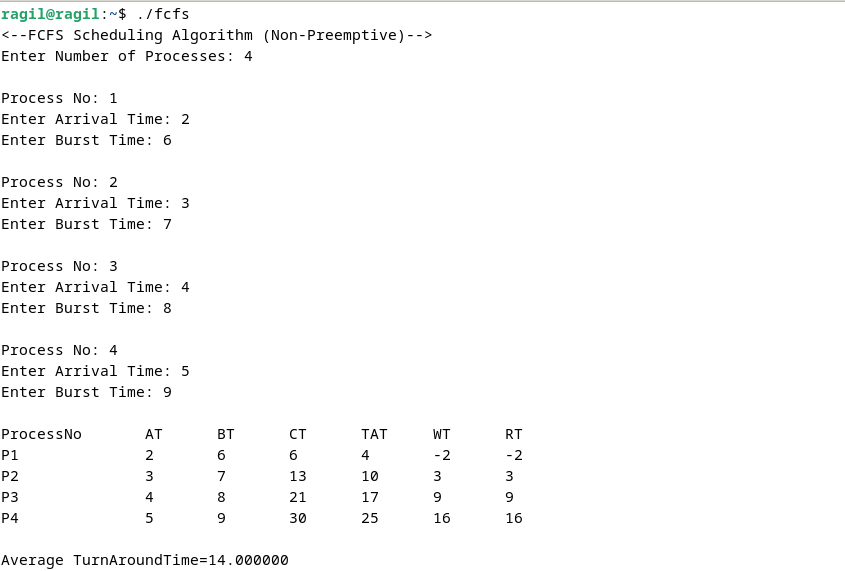
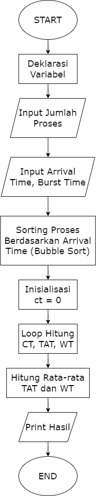
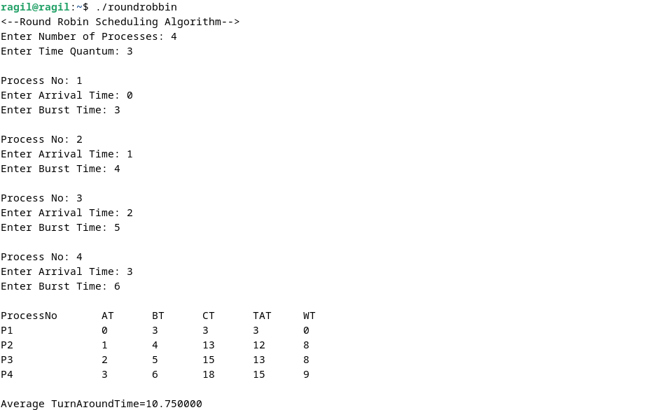
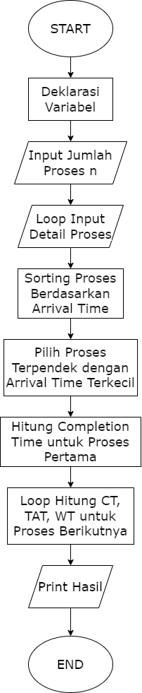
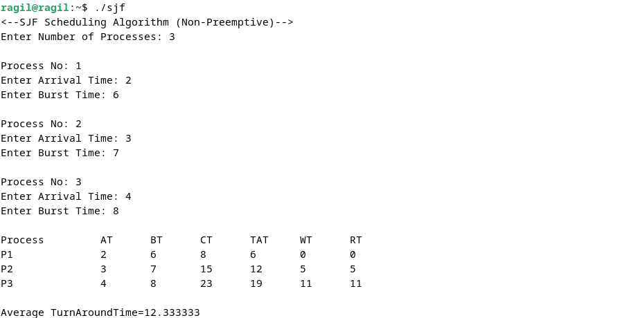
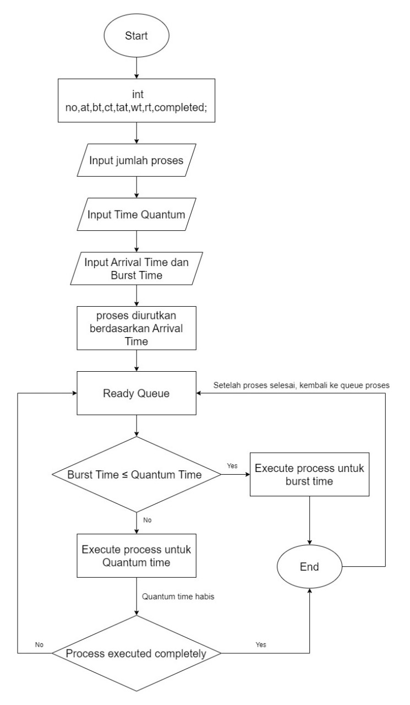

## Daftar Isi
- [First Come First Serve Algorithm](#first-come-first-serve-algorithm)
- [Shortest Job First Algorithm](#shortest-job-first-algorithm)
- [Round Robin Algorithm](#round-robin-algorithm)

# Scheduling Algorithm

## First Come First Serve Algorithm

### Percobaan Running Program

    
### Flowchart First Come First Serve Algorithm

### Analisis

Program di atas adalah implementasi algoritma penjadwalan First Come First Serve (FCFS) dalam bahasa C. Algoritma ini mengatur proses sesuai urutan kedatangan mereka. Program meminta jumlah proses, waktu kedatangan, dan waktu burst untuk setiap proses. Proses diurutkan berdasarkan waktu kedatangan menggunakan bubble sort. Kemudian, program mengeksekusi proses-proses tersebut secara berurutan, menghitung waktu selesai, Turnaround Time, dan Waiting Time. Akhirnya, program mencetak rata-rata Turnaround Time dan rata-rata Waiting Time dari semua proses yang dieksekusi. Ini membantu dalam mengevaluasi kinerja algoritma FCFS.
    

## Shortest Job First Algorithm

### Percobaan Running Program

### Flowchart Shortest Job First Algorithm

### Analisis

Program ini adalah implementasi algoritma Shortest Job First (SJF) dalam C. Algoritma ini mengatur penjadwalan proses dengan mengeksekusi proses yang memiliki waktu burst terpendek terlebih dahulu. Program meminta input jumlah dan informasi kedatangan serta waktu burst untuk setiap proses. Kemudian, proses diurutkan berdasarkan waktu kedatangan menggunakan bubble sort. Setelah itu, program mencari dan mengeksekusi proses dengan waktu burst terpendek yang telah tiba. Setelah semua proses dieksekusi, program menghitung dan mencetak waktu putaran dan waktu menunggu untuk setiap proses. Terakhir, program menghitung rata-rata waktu putaran dan waktu menunggu dari seluruh proses.

## Round Robin Algorithm

### Percobaan Running Program

### Flowchart Round Robin Algorithm

### Analisis

Program tersebut merupakan implementasi algoritma Round Robin untuk penjadwalan proses. Pertama, program meminta input jumlah proses dan quantum waktu. Kemudian, data proses (arrival time dan burst time) dimasukkan dan diurutkan berdasarkan arrival time. Proses kemudian dieksekusi sesuai algoritma Round Robin, dengan mengecek quantum time untuk setiap proses. Ketika suatu proses selesai dieksekusi, program menghitung completion time, turnaround time, dan waiting time. Setelah semua proses selesai dieksekusi, program mencetak data hasil penjadwalan, termasuk rata-rata turnaround time dan waiting time.

