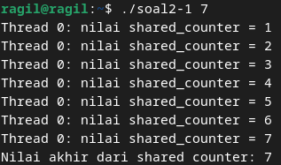
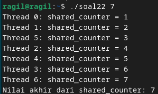

# SOAL NO 2

## Non Mutex
#### Source code
    #include <pthread.h>
    #include <stdio.h>
    #include <stdlib.h>

    int shared_counter = 0;
    pthread_mutex_t mutex = PTHREAD_MUTEX_INITIALIZER;

    void *thread_function(void *arg)
    {
    pthread_t tid = pthread_self();

    // Mengunci mutex sebelum mengakses shared_counter
    pthread_mutex_lock(&mutex);
    shared_counter++;
    printf("Thread %ld: nilai shared_counter = %d\n", (long)tid, shared_counter);
    // Membuka kunci mutex setelah mengakses shared_counter
    pthread_mutex_unlock(&mutex);

    return NULL;
    }

    int main(int argc, char *argv[])
    {
    if (argc != 2)
    {
        printf("Gunakan: %s <number_of_threads>\n", argv[0]);
        exit(EXIT_FAILURE);
    }

    int num_threads = atoi(argv[1]);

    pthread_t *threads = (pthread_t *)malloc(num_threads * sizeof(pthread_t));

    if (threads == NULL)
    {
        perror("malloc");
        exit(EXIT_FAILURE);
    }

    for (int i = 0; i < num_threads; i++)
    {
        int status = pthread_create(&threads[i], NULL, thread_function, NULL);
        if (status != 0)
        {
            printf("Error: pthread_create() returned error code %d\n", status);
            exit(EXIT_FAILURE);
        }
    }

    for (int i = 0; i < num_threads; i++)
    {
        int status = pthread_join(threads[i], NULL);
        if (status != 0)
        {
            printf("Error: pthread_join() returned error code %d\n", status);
            exit(EXIT_FAILURE);
        }
    }

    free(threads);

    printf("Nilai akhir dari shared counter: %d\n", shared_counter);

    return 0;
    }
    

#### Output

#### Analisa
  Program ini adalah contoh program dalam bahasa C yang menggunakan pustaka pthread (POSIX Threads) untuk membuat dan menjalankan beberapa thread secara paralel. Tujuan dari program ini adalah untuk menunjukkan penggunaan thread dalam melakukan operasi sederhana, yaitu penambahan nilai pada variabel `shared_counter` oleh setiap thread.

  Pertama-tama, program meminta pengguna untuk memasukkan jumlah thread yang ingin dibuat melalui argumen baris perintah. Jumlah thread ini ditentukan oleh pengguna saat program dijalankan. Jika pengguna tidak memberikan jumlah thread yang diharapkan, program akan menampilkan pesan kesalahan dan keluar.

  Setelah mendapatkan jumlah thread yang diinginkan, program membuat array dari tipe data `pthread_t` untuk menyimpan ID dari setiap thread yang akan dibuat. Kemudian, program memulai iterasi untuk membuat thread sebanyak jumlah yang diminta pengguna. Setiap kali sebuah thread dibuat, fungsi `pthread_create` dipanggil dengan argumen berupa alamat fungsi `thread_function` yang akan dijalankan oleh thread tersebut, serta argumen yang diperlukan oleh fungsi tersebut. Dalam hal ini, fungsi `thread_function` akan menerima argumen berupa ID thread, tetapi tidak memerlukan argumen selain itu.

  Fungsi `thread_function` adalah fungsi yang akan dijalankan oleh setiap thread yang dibuat. Di dalam fungsi ini, terdapat operasi penambahan pada variabel `shared_counter` yang merupakan variabel bersama yang akan diakses oleh semua thread. Namun, untuk menghindari kondisi balapan (race condition) yang terjadi ketika beberapa thread mengakses dan mengubah variabel yang sama secara bersamaan, program menggunakan mutex (mutual exclusion) untuk mengunci akses ke `shared_counter` saat sedang dilakukan penambahan nilai, dan membukanya kembali setelah selesai.

  Setelah semua thread selesai dijalankan, program melakukan join terhadap setiap thread untuk menunggu semua thread selesai sebelum melanjutkan eksekusi. Setelah semua thread selesai, program mencetak nilai akhir dari `shared_counter`, yang sekarang telah diubah oleh semua thread, menunjukkan operasi penambahan yang berhasil dilakukan secara paralel oleh semua thread. Akhirnya, program membebaskan memori yang dialokasikan untuk array thread sebelum program selesai dieksekusi.

## Mutex
#### Source code
    #include <pthread.h>
    #include <stdio.h>
    #include <stdlib.h>
    #include <stdint.h>  // Untuk intptr_t

    int shared_counter = 0;
    pthread_mutex_t shared_counter_mutex = PTHREAD_MUTEX_INITIALIZER;

    void *thread_function(void *thread_id) 
    {
    intptr_t tid = (intptr_t)thread_id;

    pthread_mutex_lock(&shared_counter_mutex);

    shared_counter++;

    printf("Thread %ld: shared_counter = %d\n", tid, shared_counter);

    pthread_mutex_unlock(&shared_counter_mutex);

    return NULL;
    }

    int main(int argc, char *argv[]) 
    {
    if (argc != 2) {
        printf("Penggunaan: %s <number_of_threads>\n", argv[0]);
        exit(EXIT_FAILURE);
    }

    int num_threads = atoi(argv[1]);

    pthread_t *threads = (pthread_t *)malloc(num_threads * sizeof(pthread_t));
    if (threads == NULL) {
        printf("Error: Failed to allocate memory for threads\n");
        exit(EXIT_FAILURE);
    }

    for (intptr_t i = 0; i < num_threads; i++) 
    {
        int status = pthread_create(&threads[i], NULL, thread_function, (void *)i);
        if (status != 0) 
        {
            printf("Error: pthread_create() returned error code %d\n", status);
            free(threads);  // Jangan lupa membebaskan memori sebelum keluar
            exit(EXIT_FAILURE);
        }
    }

    for (int i = 0; i < num_threads; i++) {
        int status = pthread_join(threads[i], NULL);
        if (status != 0) 
        {
            printf("Error: pthread_join() returned error code %d\n", status);
            free(threads);  // Jangan lupa membebaskan memori sebelum keluar
            exit(EXIT_FAILURE);
        }
    }

    free(threads);

    printf("Nilai akhir dari shared_counter: %d\n", shared_counter);

    return 0;
    }

#### Output

#### Analisa
  Program di atas adalah contoh implementasi multithreading dalam bahasa pemrograman C menggunakan pustaka pthread (POSIX Threads). Tujuan utama program ini adalah untuk mengilustrasikan cara kerja multithreading dan penggunaan mutex untuk mengamankan akses ke sumber daya bersama, dalam hal ini adalah variabel shared_counter. Setiap thread yang dibuat akan menjalankan fungsi thread_function, yang bertanggung jawab untuk menambahkan nilai shared_counter dengan menggunakan operasi increment. Penggunaan mutex (pthread_mutex_t) digunakan untuk mengunci dan membuka kunci akses ke shared_counter, memastikan bahwa hanya satu thread yang dapat mengaksesnya pada satu waktu dan mencegah adanya kondisi perlombaan (race condition) yang dapat menyebabkan hasil yang tidak terduga.
  Program ini juga menerima jumlah thread yang akan dibuat melalui argumen baris perintah, dengan melakukan penanganan kesalahan jika jumlah argumen tidak sesuai. Penggunaan alokasi memori dinamis untuk array threads dan pembebasan memori setelah digunakan menunjukkan praktik yang baik dalam pengelolaan memori. Akhirnya, setelah semua thread selesai dieksekusi, program mencetak nilai akhir dari shared_counter, menampilkan hasil dari operasi penambahan yang dilakukan oleh thread-thread tersebut. Melalui program ini, konsep multithreading dan penggunaan mutex dapat dipahami lebih baik, serta pentingnya memperhatikan penanganan kesalahan dan pengelolaan memori dalam pengembangan perangkat lunak multithreaded.
