## POKOK BAHASAN:
```
* Pipeline
* Redirection
```
## TUJUAN PEMBELAJARAN:
Setelah mempelajari materi dalam bab ini, mahasiswa diharapkan mampu:
* Memahami konsep proses I/O dan redirection
* Memahami standar input, output dan error
* Menggunakan notasi output, append dan here document
* Memahami konsep *PIPE* dan filter
  
## DASAR TEORI:

### 1. PROSES I/O
Sebuah proses memerlukan Input dan Output. Instruksi (command) yang diberikan pada Linux melalui Shell disebut sebagai eksekusi program yang selanjutnya disebut proses. Setiap kali instruksi diberikan, maka Linux kernel akan menciptakan sebuah proses dengan memberikan nomor PID (Process Identity). Proses dalam Linux selalu membutuhkan Input dan menghasilkan suatu Output.

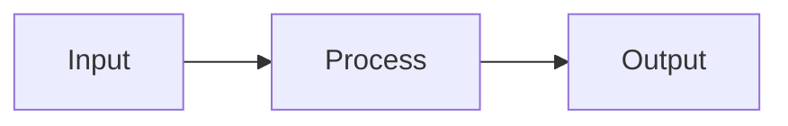

Dalam konteks Linux input/output adalah :
* Keyboard (input)
* Layar (output)
* Files
* Struktur data kernel
* Peralatan I/O lainnya (misalnya Network)

## 2. FILE DESCRIPTOR

Linux berkomunikasi dengan file melalui file descriptor yang direpresentasikan melalui angka yang dimulai dari 0, 1, 2 dan seterusnya. Tiga buah file descriptor standar yang lalu diciptakan oleh proses adalah :
* 0 = keyboard (standar input)
* 1 = layar (standar output)
* 2 = layar (standar error)

Linux tidak membedakan antara peralatan hardware dan file. Linux memanipulasi peralatan hardware dengan memperlakukannya sama dengan ketika memperlakukan sebuah file.

## 3.PEMBELOKAN (REDIRECTION)

Pembelokan dilakukan untuk standard input, output dan error, yaitu untuk mengalihkan file descriptor dari 0, 1 dan 2. Simbol untuk pembelokan adalah :
```mermaid
flowchart LR
    A(Standart Input) -->|Keyboard| B{Process}
    B -->|Monitor| C[Standart Output]
    B -->|Monitor| D[Standart Error]
 ```

## 4. PIPA (PIPELINE)
Mekanisme pipa digunakan sebagai alat komunikasi antar proses.

```mermaid
graph LR
  A(Input) --> B(Proses-1) --> C(Output) --> D(Input) --> E(Proses-2) --> F(Output)
```
Proses-1 menghasilkan output yang selanjutnya digunakan sebagai input oleh Proses-2. Hubungan output input ini dinamakan ``pipa ataiupipelining``, yang menghubungkan Proses-1 dengan Proses-2 dan dinyatakan dengan symbol “|”.
```
    Proses1 | Proses
```

## 5. FILTER
Filter adalah utilitas Linux yang dapat memproses standard input (dari keyboard) dan menampilkan hasilnya pada standard output (layar). Contoh filter adalah cat, sort, grep, pr, head, tail, paste dan lainnya.
Pada sebuah rangkaian pipa : 

        P<sub>1</sub> | P<sub>2</sub> | P<sub>3</sub> ... | P<sub>n-1</sub> | P<sub>n</sub>

Maka P2 sampai dengan P<sub>n-1</sub> berfungsi sebagai filter. P1 (awal) dan Pn (terakhir) boleh tidak filter. Utilitas yang bukan filter misalnya who, ls, ps, lp, lpr, mail dan lainnya.
Beberapa perintah Linux yang digunakan untuk proses penyaringan antara lain :
* Perintah ``grep``
  Digunakan untuk menyaring masukannya dan menampilkan baris-baris yang hanya mengandung pola yang ditentukan. Pola ini disebut regular expression.
* Perintah ``wc``
  Digunakan untuk menghitung jumlah baris, kata dan karakter dari baris-baris masukan yang diberikan kepadanya. Untuk mengetahui berapa baris gunakan option –l, untuk mengetahui berapa kata, gunakan option –w dan untuk mengetahui berapa karakter, gunakan option –c. 
  Jika salah satu option tidak digunakan, maka tampilannya adalah jumlah baris, jumlah kata dan jumlah karakter.
* Perintah ``sort``
  Digunakan untuk mengurutkan masukannya berdasarkan urutan nomor ASCII dari karakter.
* Perintah ``cut``
  Digunakan untuk mengambil kolom tertentu dari baris-baris masukannya, yang ditentukan pada option –c.
* Perintah ``uniq``
  Digunakan untuk menghilangkan baris-baris berurutan yang mengalami duplikasi, biasanya digabungkan dalam pipeline dengan ``sort``.

## TUGAS PENDAHULUAN:

## Jawablah pertanyaan-pertanyaan di bawah ini :

1. Apa yang dimaksud redirection?
2. Apa yang dimaksud pipeline?
3. Apa yang dimaksud perintah di bawah ini :
    echo, cat, more, sort, grep, wc, cut, uniq

## Jawaban :

1. <b>Redirection (Pembelokan) :</b> 
Redirection adalah teknik mengalihkan input atau output dari standarnya.
2. <b>Pipeline (Pipa):</b>
 Mekanisme pipa digunakan sebagai alat komunikasi antar proses.
 Input => Proses 1 => Output = Input => Proses 2 => Output
Proses 1 menghasilkan output yang selanjutnya digunakan sebagai input oleh Proses 2. Hubungan output input ini dinamakan pipa, yang menghubungkan Proses 1 dengan Proses 2 dan dinyatakan dengan symbol "|".
   ```
   Proses1 | Proses
   ```
3. Yang dimaksud perintah di bawah ini adalah :
<br><b>echo :</b> Menampilkan output kelayar 
<br><b>cat :</b> Menghasilkan output kelayar dan merupakan berasal dari input sebuah keyboard
<br><b>more :</b> Perintah untuk mempaging halaman 
<br><b>sort :</b> Mengurutkan masukannya berdasarkan urutan nomor ASCII dari karakter 
<br><b>grep :</b> Menyaring masukannya dan menampilkan baris-baris yang hanya mengandung pola yang ditentukan. Pola ini disebut regular expression
<br><b>wc :</b> Menghitung jumlah baris, kata dan karakter dari baris-baris masukan yang diberikan kepadanya. Untuk mengetahui berapa baris gunakan option –l, untuk mengetahui berapa kata, gunakan option –w dan untuk mengetahui berapa karakter, gunakan option –c. 
  Jika salah satu option tidak digunakan, maka tampilannya adalah jumlah baris, jumlah kata dan jumlah karakter.
<br><b>cut :</b> Mengambil kolom tertentu dari baris baris masukannya yang ditentukan pada option -c 
<br><b>uniq :</b> Menghilangkan baris-baris berurutan yang mengalami duplikasi, biasanya digabungkan dalam pipeline dengan sort
<br>

## PERCOBAAN:

1. Login sebagai user.
2. Bukalah Console Terminal dan lakukan percobaan-percobaan di bawah ini. Perhatikan hasil setiap percobaan.
3. Selesaikan soal-soal latihan.


## Percobaan 1 : File descriptor

1. Output ke layar (standar output), input dari system (kernel)
    ```
    $ ps
    ```

   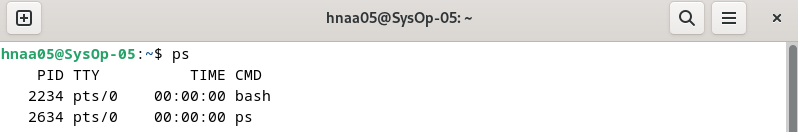
   <br>
   Analisis: 
    <br>Perintah ps digunakan untuk menampilkan daftar proses yang sedang berjalan di sistem operasi. Outputnya memuat informasi tentang setiap proses, seperti:<br>
    PID (Process ID): Untuk mengidentifikasi setiap proses unik, TTY (TeleType): Terminal yang terkait dengan proses, TIME: Waktu CPU kumulatif yang digunakan oleh proses, dalam format menit dan detik, CMD (Command): Nama program atau perintah yang memulai proses.<br>
2. Output ke layar (standar output), input dari keyboard (standard input)
   ```
    $ cat
    hallo, apa khabar
    hallo, apa khabar
    exit dengan ^d
    exit dengan ^d
    [Ctrl-d]
   ```

   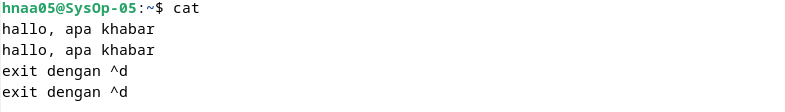
   <br>
    Analisis:
    <br>Cat digunakan untuk menampilkan konten dan dapat dihentikan dengan menekan Ctrl-D.<br>

3. Input nama direktori, output tidak ada (membuat direktori baru), bila terjadi error maka tampilan error pada layar (standard error)
   ```
   $ mkdir mydir
   $ mkdir mydir **(Terdapat pesan error)**
   ```

   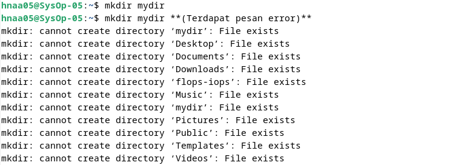
   <br>
    Analisis:
    <br>mkdir adalah perintah untuk membuat direktori baru dan bila terjadi error maka akan tampil di layar.<br>

## Percobaan 2 : Pembelokan (redirection)
1. Pembelokan standar output
   ```
    $ cat 1> myfile.txt
    Ini adalah teks yang saya simpan ke file myfile.txt
   ```

   
   <br>
    Analisis:
    <br>Perintah cat1> myfile.txt digunakan untuk mengcopy input dan menyimpannya didalam myfile.txt.<br>

2. Pembelokan standar input, yaitu input dibelokkan dari keyboard menjadi dari file
   ```
    $ cat 0< myfile.txt
    $ cat myfile.txt
   ```

   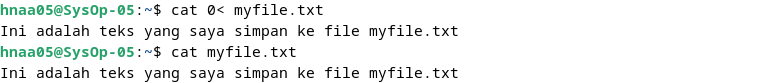
   <br>
   Analisis:
   <br>Perintah cat 0> digunakan untuk menunjuk sebuah input yang berasal dari myfile.<br>

3. Pembelokan standar error untuk disimpan di file
   ```
    $ mkdir mydir (Terdapat pesan error)
    $ mkdir mydir 2> myerror.txt
    $ cat myerror.txt
   ```

   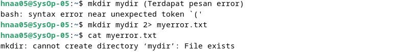
   <br>
    Analisis:
    <br>Jika terdapat pesan error didirectory maka akan dialihkan ke file my error menggunakan 2><br>

4. Notasi 2>&1 : pembelokan standar error (2>) adalah identik dengan file descriptor 1.
   ```
    $ ls filebaru (Terdapat pesan error)
    $ ls filebaru 2> out.txt
    $ cat out.txt
    $ ls filebaru 2> out.txt 2>&
    $ cat out.txt
   ```

   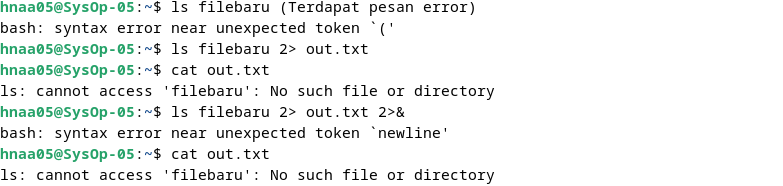
   <br>
   Analisis:
   <br>Membelokkan error menggunakan 2>&1, dan mengarahkan standar error ke dalam file out,txt<br>

5. Notasi 1>&2 (atau >&2) : pembelokan standar output adalah sama dengan file descriptor 2 yaitu standar error
   ```
   $ echo “mencoba menulis file” 1> baru
   $ cat filebaru 2> baru 1>&
   $ cat baru
   ```

   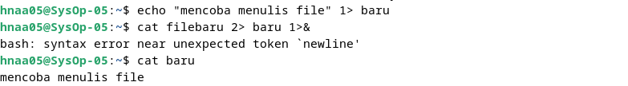
   <br>
   Analisis:
   <br>Perintah echo digunakan untuk menulis teks ke dalam file baru menggunakan operator >. Kemudian pesan dari echo akan dimasukkan ke dalam file baru. cat biasanya digunakan untuk menampilkan isi dari file       atau standar input.<br>

6. Notasi >> (append)
   ```
   $ echo “kata pertama” > surat
   $ echo “kata kedua” >> surat
   $ echo “kata ketiga” >> surat
   $ cat surat
   $ echo “kata keempat” > surat
   $ cat surat
   ```

   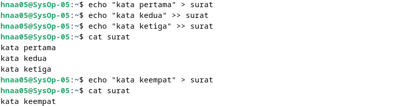
   <br>
   Analisis:
   <br>Menginputkan teks menggunakan perintah echo dan mengirimkan teks tersebut ke surat. Untuk mengakhiri input teks, menggunakan notasi >><br>

7. Notasi here document (<<++ .... ++) digunakan sebagai pembatas input dari keyboard. Perhatikan bahwa tanda pembatas dapat digantikan dengan tanda apa saja, namun harus sama dan tanda penutup harus diberikan pada awal baris
   ```
   $ cat <<++
   Hallo, apa kabar?
   Baik-baik saja?
   Ok!
   ++
   $ cat <<%%%
   Hallo, apa kabar?
   Baik-baik saja?
   Ok!
   %%%
   ```

   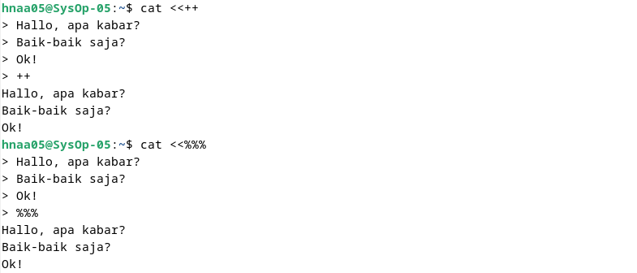
   <br>
   Analisis:
   <br>Menginputkan sebuah teks dengan perintah cat <<++ dan cat <<%%%, dan ketika selesai input, harus memberikan batasan yang sama seperti contoh perintah ++ dan %%%.<br>

8. Notasi – (input keyboard) adalah representan input dari keyboard. Artinya menampilkan file 1, kemudian menampilkan input dari keyboard dan menampilkan file 2. Perhatikan bahwa notasi “-“ berarti menyelipkan input dari keyboard
   ```
   $ cat myfile.txt – surat
   ```

   
   <br>
    Analisis:
    <br>Perintah $ cat  myfile.txt untuk menampilkan isi dua file. Pertama, perintah cat akan menampilkan isi file myfile.txt. Kemudian, perintah cat akan menampilkan isi file surat yang disimpan ke file      myfile.txt<br>

## Percobaan 3 : Pipa (pipeline)

1. Operator pipa (|) digunakan untuk membuat eksekusi proses dengan melewati data langsung ke data lainnya.
   ```
   $ who
   $ who | sort
   $ who | sort –r
   $ who > tmp
   $ sort tmp
   $ rm tmp
   $ ls –l /etc | more
   $ ls –l /etc | sort | more
   ```

   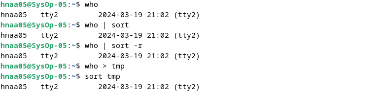
   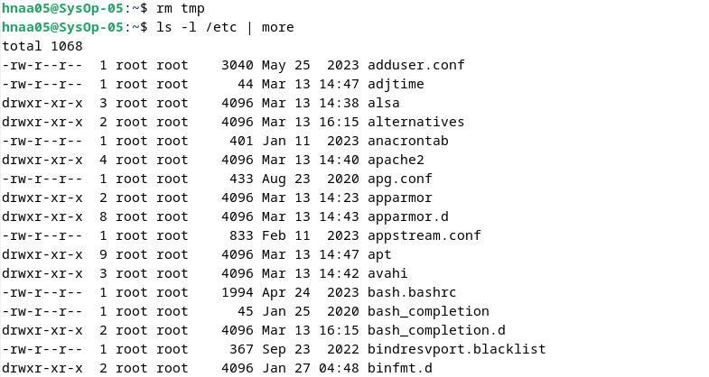
   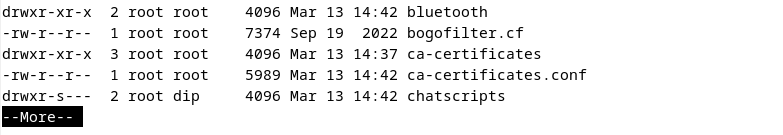
   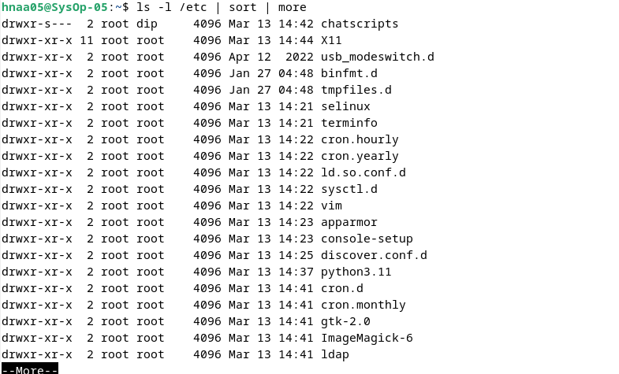
   <br>
   Analisis:
   <br>Perintah who menampilkan daftar pengguna yang sedang masuk (logged in) ke sistem.<br>
   <br>Menggunakan operator pipe (|), perintah who diarahkan ke perintah sort, yang kemudian mengurutkan daftar pengguna sesuai abjad berdasarkan nama pengguna.<br>
   <br>Perintah who | sort -r mengurutkan daftar pengguna secara terbalik (dari belakang ke depan).<br>
   <br>Menggunakan operator redirection (>), output dari perintah who dialihkan ke dalam file tmp, menyimpan daftar pengguna yang sedang masuk ke dalam file tersebut.<br>
   <br>Perintah sort tmp mengurutkan isi dari file tmp, yang berisi daftar pengguna yang sedang masuk sesuai urutan abjad.<br>
   <br>Perintah rm tmp menghapus file tmp yang sudah tidak diperlukan lagi setelah penggunaan sebelumnya.<br>
   <br>Perintah ls -l /etc | more menampilkan daftar isi dari direktori /etc secara lebih detail dengan perintah ls -l, dan outputnya dialihkan ke program more.<br>
   <br>Perintah ls -l /etc | sort | more mengurutkan daftar isi dari perintah sebelumnya sebelum outputnya ditampilkan oleh more.<br>
  
2. Untuk membelokkan standart output ke file, digunakan operator ">"
   ```
   $ echo hello
   $ echo hello > output
   $ cat output
   ```

   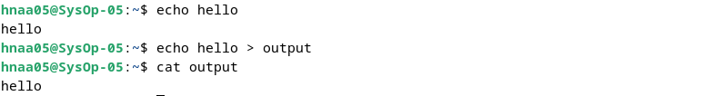
   <br>
   Analisis:
   <br>Perintah ($ echo hello) akan menampilkan teks "hello" di terminal pada baris pertama. Tanda > digunakan untuk mengarahkan output dari perintah echo ke dalam file output yang menampilkan "hello".<br>

3. Untuk menambahkan output ke file digunakan operator ">>"
   ```
   $ echo bye >> output
   $ cat output
   ```

   
   <br>
   Analisis:
   <br>Perintah ($ echo bye >> output) akan menambahkan teks "bye" ke dalam file. Tanda >> digunakan untuk menambahkan teks ke akhir file tanpa menghapus konten yang sudah ada, sehingga akan menampilkan "hello" dan "bye" pada baris yang berbeda.<br>

4. Untuk membelokkan standart input digunakan operator "<"
   ```
   $ cat < output
   ```

   
   <br>
  Analisis:
  <br>Tanda < digunakan untuk mengarahkan input kedalam suatu file lainnya<br>

5. Pembelokan standart input dan standart output dapat dikombinasikan tetapi tidak boleh menggunakan nama file yang sama sebagai standart input dan output.
   ```
   $ cat < output > out
   $ cat out
   $ cat < output >> out
   $ cat out
   $ cat < output > output
   $ cat output
   $ cat < out >> out (Proses tidak berhenti)
   [Ctrl-c]
   $ cat out
   ```

   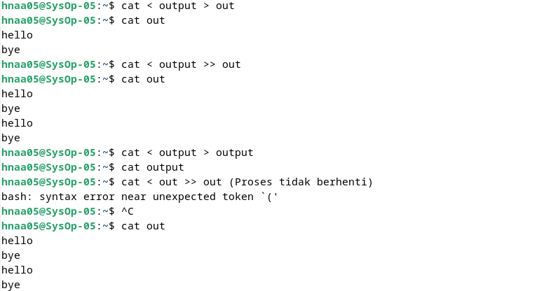

## Percobaan 4 : Filter
1. Pipa juga digunakan untuk mengkombinasikan utilitas sistem untuk membentuk fungsi yang lebih kompleks
   ```
    $ w –h | grep <user>
    $ grep <user> /etc/passwd
    $ ls /etc | wc
    $ ls /etc | wc –l
    $ cat > kelas1.txt
    Badu
    Zulkifli
    Yulizir
    Yudi
    Ade
    [Ctrl-d]
    $ cat > kelas2.txt
    Budi
    Gama
    Asep
    Muchlis
    [Ctrl-d]
    $ cat kelas1.txt kelas2.txt | sort
    $ cat kelas1.txt kelas2.txt > kelas.txt
    $ cat kelas.txt | sort | uniq
   ```

   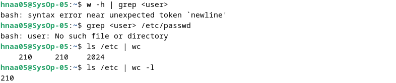
   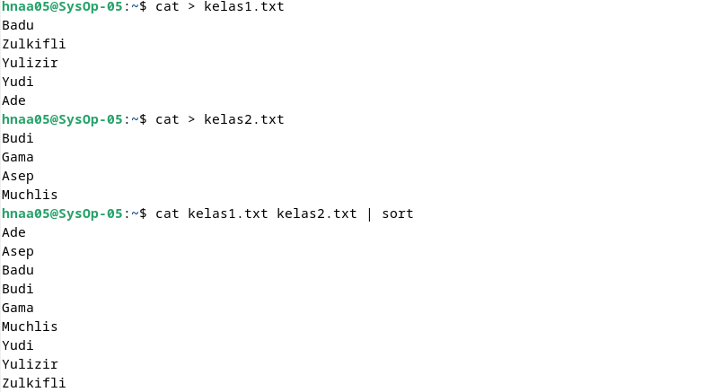
   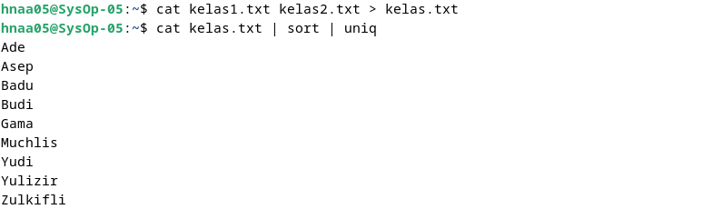
   <br>
   Analisis:
   <br>Pertama, perintah `$ w -h | grep <user>` digunakan untuk menampilkan informasi tentang pengguna yang sedang masuk ke sistem tanpa header, dengan menggunakan grep untuk mencari baris yang mengandung kata <user>.
Perintah berikutnya, `$ grep <user> /etc/passwd`, bertujuan untuk mencari entri pengguna dengan nama pengguna <user> dalam file /etc/passwd, yang berisi daftar pengguna yang terdaftar di sistem.
Perintah `$ ls /etc | wc` digunakan untuk menghitung jumlah baris, kata, dan byte dari hasil perintah `ls /etc`, yaitu daftar isi direktori /etc.
Perintah `$ ls /etc | wc -l` bertujuan untuk menghitung jumlah file dan direktori dalam direktori /etc, dengan menggunakan opsi -l untuk hanya menghitung jumlah baris (yaitu jumlah file dan direktori).
Perintah berikutnya menciptakan dua file teks (kelas1.txt dan kelas2.txt) dengan menggunakan perintah `cat > namafile`. Setiap file berisi daftar nama siswa.
Setelah itu, perintah `$ cat kelas1.txt kelas2.txt | sort` digunakan untuk menggabungkan isi dari kedua file dan mengurutkannya.
Perintah `$ cat kelas1.txt kelas2.txt > kelas.txt` bertujuan untuk menggabungkan isi dari kedua file menjadi satu file bernama kelas.txt.
Perintah `$ cat kelas.txt | sort | uniq` bertujuan untuk menggabungkan isi dari file kelas.txt, mengurutkannya, dan menghilangkan baris yang duplikat menggunakan perintah `uniq`.<br>

## LATIHAN:

1. Lihat daftar secara lengkap pada direktori aktif, belokkan tampilan standard output ke file baru.

   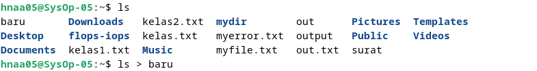
   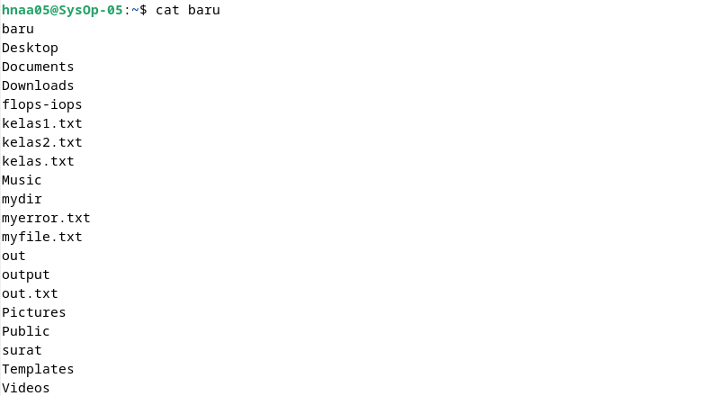
   <br>
   Analisis:
   <br>Pada latihan ini, perintah pertama yang digunakan adalah ls untuk melihat daftar file, kemudian mengalihkan output dari ls untuk disimpan ke dalam file baru, dan kemudian mencetaknya.<br>

2. Lihat daftar secara lengkap pada direktori /etc/passwd, belokkan tampilan standard output ke file baru tanpa menghapus file baru sebelumnya.

   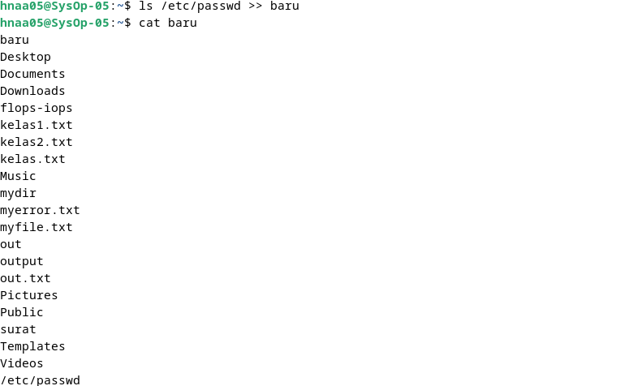
   <br>
   Analisis:
   <br>Menggunakan `ls` untuk melihat direktori /etc/passwd, dan mengalihkan outputnya ke dalam file baru tanpa menghapus isi dari file sebelumnya menggunakan operator >>.<br>

3. Urutkan file baru dengan cara membelokkan standard input.

   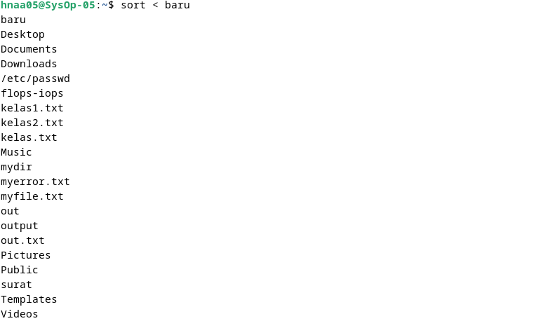
   <br>
   Analisis:
   <br>Membelokkan standard input dari file baru dengan perintah `sort` untuk mengurutkan isi dari file baru sesuai dengan huruf pertama. Di sini, file baru menjadi input dari perintah sort.<br>

4. Urutkan file baru dengan cara membelokkan standard input dan standard output ke file baru.urut.

   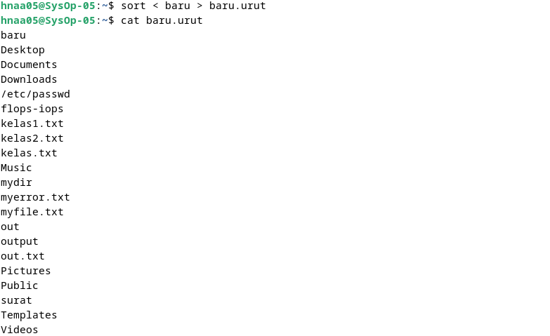
   <br>
   Analisis:
   <br>Membelokkan standard input dari file baru dengan perintah `sort` untuk mengurutkan isi dari file baru sesuai dengan huruf pertama. Di sini, file baru menjadi input dari perintah sort. Kemudian, output dari perintah sort `< baru` dibelokkan ke dalam file `baru.urut`, dan dicetak menggunakan `cat`.<br>

5. Buatlah direktori latihan 2 sebanyak 2 kali dan belokkan standard error ke file rmdirerror.txt.

   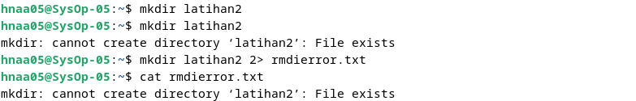
   <br>
   Analisis:
   <br>Membuat direktori `latihan2` menggunakan perintah `mkdir` sebanyak 2 kali, lalu akan terjadi output error. Output error tersebut dibelokkan ke dalam file `rmdierror.txt` menggunakan operator pembelokan standard error yaitu `2>`. Kemudian mencetak file `rmdierror.txt` menggunakan perintah `cat`.<br>

6. Urutkan kalimat berikut :
   ```
   Jakarta
   Bandung
   Surabaya
   Padang
   Palembang
   Lampung
   ```
   Dengan menggunakan notasi **here document (<@@@ ...@@@)** . [HINT](https://www.geeksforgeeks.org/how-to-use-here-document-in-bash-programming/)

   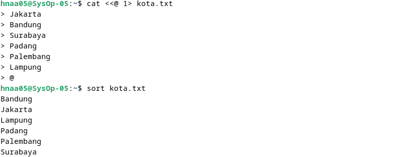
   <br>
   Analisis:
   <br>Membuat list nama kota menggunakan notasi here document `<<@....@` dan menyimpannya ke dalam file `kota.txt`, lalu mengurutkan isi dari file tersebut menggunakan perintah `sort`.<br>

7. Hitung jumlah baris, kata dan karakter dari file baru.urut dengan menggunakan filter dan tambahkan data tersebut ke file baru.

   
   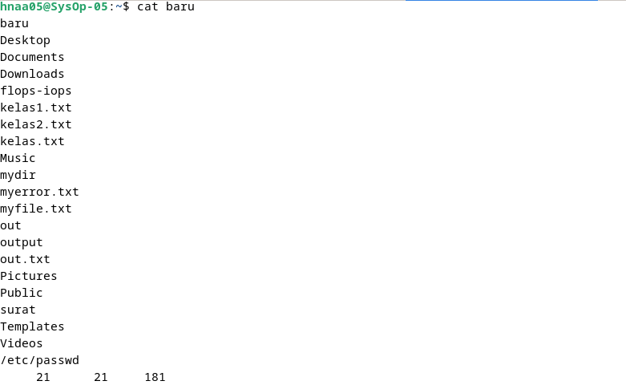
   <br>
   Analisis:
   <br>Membelokkan standard input dari `cat`, sehingga `baru.urut` menjadi input untuk perintah `cat`. Lalu dengan menggunakan pipeline dilanjutkan dengan perintah `wc` untuk menghitung jumlah baris, kata, dan karakter dari `baru.urut`. Output dari perintah yang tadi dibelokkan menuju file baru tanpa menghapus isi dari file baru sebelumnya menggunakan operator `>>`.<br>

8. Gunakan perintah di bawah ini dan perhatikan hasilnya.
   ```
    $ cat > hello.txt
    dog cat
    cat duck
    dog chicken
    chicken duck
    chicken cat
    dog duck
    [Ctrl-d]
    $ cat hello.txt | sort | uniq
    $ cat hello.txt | grep “dog” | grep –v “cat”
   ```

   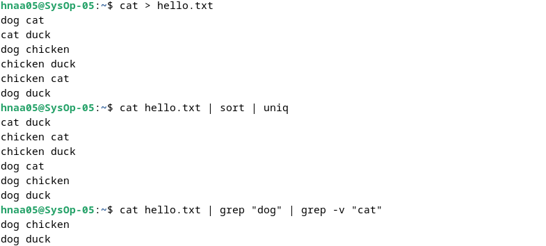
   <br>
   Analisis:
   <br>Dengan menggunakan perintah `$ cat > hello.txt`, Anda membuat file baru bernama "hello.txt" yang berisi beberapa baris teks yang berisi kata-kata seperti "dog", "cat", "kuda", dan "ayam". Kemudian, dengan menggunakan perintah `$ cat hello.txt | sort | uniq`, Anda membaca isi file "hello.txt" secara alfabetis dan kemudian menggunakan `uniq` untuk menghilangkan kata-kata yang sama.<br>

## KESIMPULAN

Sebuah proses memerlukan Input dan Output. Instruksi (command) yang diberikan pada Linux melalui Shell disebut sebagai eksekusi program yang selanjutnya disebut proses. Setiap kali instruksi diberikan, maka Linux kernel akan menciptakan sebuah proses dengan memberikan nomor PID (Process Identity). Proses dalam Linux selalu membutuhkan Input dan menghasilkan suatu Output. Linux berkomunikasi dengan file melalui file descriptor yang direpresentasikan Pada Linux, terdapat metode File Descriptor, Redirection, Pipelining, dan filter. 

File descriptor merupakan cara Linux berkomunikasi dengan file. File descriptor direpresentasikan melalui angka yang dimulai dari 0, 1, 2 dan seterusnya. Redirection adalah pembelokan yang dilakukan untuk standar input, output, dan error dan untuk mengalihkan file descriptor dari 0, 1, dan 2. Pipeline adalah 
suatu mekanisme pipa yang digunakan sebagai alat komunikasi antar proses. Sedangkan filter adalah utilitas Linux yang dapat memproses standard input (dari keyboard) dan menampilkan hasilnya pada standard output (layar).

## LAPORAN RESMI:

1. Analisa hasil percobaan 1 sampai dengan 4, untuk setiap perintah jelaskan tampilannya.
2. Kerjakan latihan diatas dan analisa hasilnya
3. Berikan kesimpulan dari praktikum ini.
