## Daftar Isi

1. [Pokok Bahasan](#pokok-bahasan)
2. [Tujuan Belajar](#tujuan-belajar)
3. [Dasar Teori](#dasar-teori)
4. [Laporan Hasil Percobaan 5](#percobaan-5--menghentikan-dan-memulai-kembali-job)
5. [Laporan Hasil Percobaan 6](#percobaan-6--percobaan-dengan-penjadwalan-prioritas)
6. [Laporan Hasil Latihan](#latihan)

## Proses dan Manajemen Proses

### POKOK BAHASAN

- Proses pada Sistem Operasi Linux
- Manajemen Proses pada Sistem Operasi Linux

### TUJUAN BELAJAR

Setelah mempelajari materi dalam bab ini, mahasiswa diharapkan mampu:

- Memahami konsep proses pada sis tem operasi Linux.
- Menampilkan beberapa cara menampilkan hubungan proses parent dan child.
- Menampilkan status proses dengan beberapa format berbeda.
- Melakukan pengontrolan proses pada shell.
- Memahami penjadwalan prioritas.

### DASAR TEORI

#### 1. KONSEP PROSES PADA SISTEM OPERASI LINUX

Proses adalah program yang sedang dieksekusi. Setiap kali menggunakan utilitas sistem atau program aplikasi dari shell, satu atau lebih proses ”child” akan dibuat oleh shell sesuai perintah yang diberikan. Setiap kali instruksi dibe rikan pada Linux shell, maka kernel akan menciptakan sebuah proses-id. Proses ini disebut juga dengan terminology Unix sebagai sebuah Job. Proses Id (PID) dimulai dari 0, yaitu proses INIT, kemudian diikuti oleh proses berikutnya (terdaftar pada /etc/inittab).
Beberapa tipe proses :

- Foreground  
  Proses yang diciptakan oleh pemakai langsung pada terminal (interaktif, dialog)
- Batch  
  Proses yang dikumpulkan dan dijalankan secara sekuensial (satu persatu). Prose Batch tidak diasosiasikan (berinteraksi) dengan terminal.
- Daemon  
  Proses yang menunggu permintaan (request) dari proses lainnya dan menjalankan tugas sesuai dengan permintaan tersebut. Bila tidak ada request, maka program ini akan berada dalam kondisi “idle” dan tidak menggunakan waktu hitung CPU. Umumnya nama proses daemon di UNIX berakhiran d, misalnya inetd, named, popd dll

#### 2. SINYAL

Proses dapat mengirim dan menerima sinyal dari dan ke proses lainnya. Proses mengirim sinyal melalui instruksi “kill” dengan format  

    kill [-nomor sinyal] PID

Nomor sinyal : 1 s/d maksimum nomor sinyal yang didefinisikan system Standar nomor sinyal yang terpenting adalah :

| No Sinyal | Nama    | Deskripsi                                                                             |
| --------- | ------- | ------------------------------------------------------------------------------------- |
| 1         | SIGHUP  | Hangup, sinyal dikirim bila proses terputus, misalnya melalui putusnya hubungan modem |
| 2         | SIGINT  | Sinyal interrupt, melalui ^C                                                          |
| 3         | SIGQUIT | Sinyal Quit, melalui ^\|                                                              |
| 9         | SIGKILL | Sinyal Kill, menghentikan proses                                                      |
| 15        | SIGTERM | Sinyal terminasi software                                                             |

#### 3. MENGIRIM SINYAL

Mengirim sinyal adalah satu alat komunikasi antar proses, yaitu memberitahukan proses yang sedang berjalan bahwa ada sesuatu yang harus dikendalikan. Berdasarkan sinyal yang dikirim ini maka proses dapat bereaksi dan administrator/programmer dapat menentukan reaksi tersebut. Mengirim sinyal menggunakan instruksi

    kill [-nomor sinyal] PID

Sebelum mengirim sinyal PID proses yang akan dikirim harus diketahui terlebih dahulu.

#### 4. MENGONTROL PROSES PADA SHELL

Shell menyediakan fasilitas job control yang memungkinkan mengontrol beberapa job atau proses yang sedang berjalan pada waktu yang sama. Misalnya bila melakukan pengeditan file teks dan ingin melakukan interrupt pengeditan untuk mengerjakan hal lainnya. Bila selesai, dapat kembali (switch) ke editor dan melakukan pengeditan file teks kembali. 
Job bekerja pada <strong>foreground</strong> atau <strong>background</strong>. Pada foreground hanya diper untukkan untuk satu job pada satu waktu. Job pada foreground akan mengontrol shell - menerima input dari keyboard dan mengirim output ke layar. Job pada background tidak menerima input dari terminal, biasanya berjalan tanpa memerlukan interaksi 
Job pada foreground kemungkinan dihentikan sementara (suspend), dengan menekan [Ctrl-Z]. Job yang dihentikan sementara dapat dijalankan kembali pada foreground atau background sesuai keperluan dengan menekan <strong>”fg”</strong> atau <strong>”bg”</strong>. Sebagai catatan, menghentikan job seme ntara sangat berbeda dengan melakuakan interrupt job (biasanya menggunakan [Ctrl-C]), dimana job yang diinterrup akan dimatikan secara permanen dan tidak dapat dijalankan lagi.

#### 5. MENGONTROL PROSES LAIN

Perintah ps dapat digunakan untuk menunjukkan semua proses yang sedang berjalan pada mesin (bukan hanya proses pada shell saat ini) dengan format :

    ps –fae atau
    ps -aux

Beberapa versi UNIX mempunyai utilitas sistem yang disebut top yang menyediakan cara interaktif untuk memonitor aktifitas sistem. Statistik secara detail dengan proses yang berjalan ditampilkan dan secara terus-menerus di-refresh . Proses ditampilkan secara terurut dari utilitas CPU. Kunci yang berguna pada top adalah

    s – set update frequency
    u – display proses dari satu user
    k – kill proses (dengan PID)
    q – quit

Utilitas untuk melakukan pengontrolan proses dapat ditemukan pada sistem UNIX adalah perintah killall. Perintah ini akan menghentikan proses sesuai PID atau job number proses.

### Percobaan 5 : Menghentikan dan Memulai Kembali Job

1. Perintah `yes > /dev/null`

   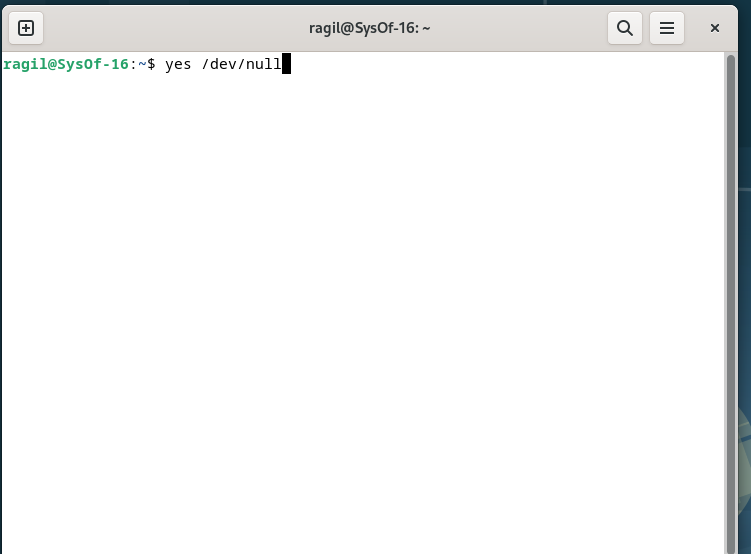

   Analisa : Alternatif untuk menjalankan pekerjaan di latar belakang adalah dengan memulainya secara biasa (di latar depan), kemudian menghentikannya sementara dan melanjutkannya di latar belakang. Anda dapat memanfaatkan perintah yes > /dev/null untuk memulai sebuah pekerjaan baru. Alih-alih mengakhiri pekerjaan, tindakan ini hanya menunda pekerjaan tersebut sampai Anda memutuskan untuk melanjutkannya lagi. Untuk menunda pekerjaan sementara, tekan Ctrl + Z.

2. Perintah `fg`

   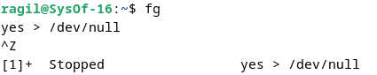

   Analisa: Perintah `fg` disini digunakan untuk me-restart job pada foreground.

3. Perintah `bg`

   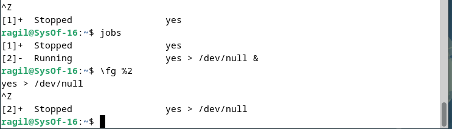

   Analisa : Setelah instruksi fg, Shell akan menampilkan nama perintah yang diletakkan di foreground. Stop job lagi dengan Ctrl + Z. Kemudian gunakan perintah bg untuk meletakkan job pada background.

   Perintah `fg`

   Analisa : Job tidak bisa dihentikan dengan Ctrl + Z karena job berada pada background. Untuk menghentikannya, letakkan job pada foreground dengan fg dan kemudian hentikan sementara dengan Ctrl + Z.

4. Perintah `yes &`

   

   Analisa : Job yang berjalan di latar belakang bisa menunjukkan teks di terminal, dan bisa ditinggalkan sementara kita melakukan Job lain, seperti perintah yang disebutkan sebelumnya. Untuk menghentikan Job tersebut, kita tidak bisa langsung menggunakan Ctrl + C. Sebaliknya, Job tersebut perlu dipindahkan ke latar depan dengan mengetik fg dan menekan enter. Setelah itu, kita bisa menekan Ctrl + Z untuk secara sementara menghentikannya.

5. Perintah `fg %2`, `bg %2`, atau `%2`

   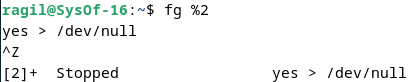 

   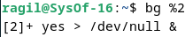

   Analisa : Perintah di atas digumakan apabila ingin menjalankan banyak job dalam satu waktu, letakkan job pada foreground atau background dengan memberikan job ID.

7. Perintah `fg`

   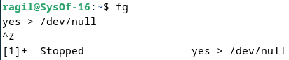

   Analisa : tekan fg dan tekan Enter, kemudian dilanjutkan dengan Ctrl-Z untuk menghentikan sementara

8. Perintah `ps -fae`

   

   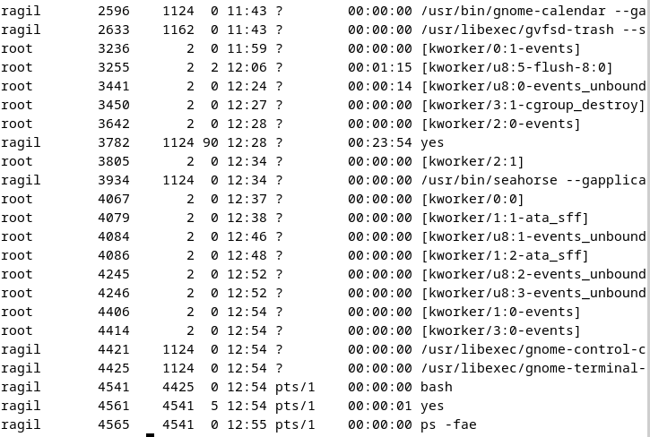

   Analisa : Lihat job dengan perintah ps -fae dan tekan Enter. Kemudian hentikan proses dengan perintah kill. Pada proses di atas proses yang dihentikan adalah proses dengan PID 6142, yaitu proses yes > /dev/null

9. Logout dan tekan Alt+F7 untuk kembali ke mode grafis

### Percobaan 6 : Percobaan dengan Penjadwalan Prioritas

1. Login sebagai root.
2. Buka 3 terminal, tampilkan pada screen yang sama.

3. Pada setiap terminal, ketik `PS1="\w;"` diikuti Enter. `\w` menampilkan path pada direktori home.

   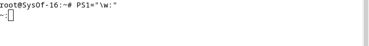

4. Karena login sebagai root, maka akan ditampilkan `~;` pada setiap terminal. Untuk setiap terminal ketik `pwd` dan tekan Enter untuk melihat bahwa Anda sedang berada pada direktori /root.

   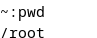

5. Buka terminal lagi (keempat), atur posisi sehingga keempat terminal terlihat pada screen.

6. Pada terminal keempat, ketik `top` dan tekan Enter. Maka program `top` akan muncul. Ketik i. `Top` akan menampilkan proses yang aktif. Ketik `lmt`. `Top` tidak lagi menampilkan informasi pada bagian atas dari screen. Pada percobaan ini, terminal ke empat sebagai jendela `Top`.

   Ketik `lmt`

   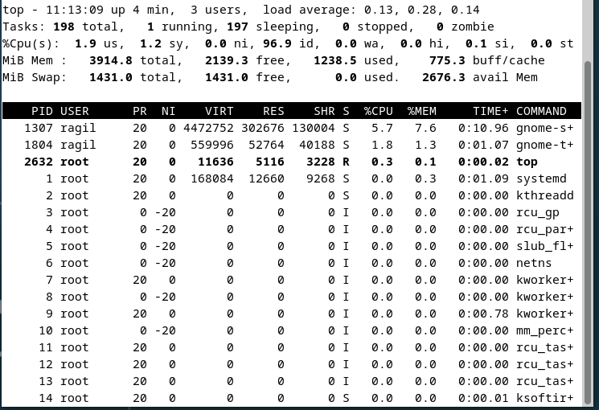

7. Pada terminal 1, bukalah program executable C++ dengan mengeti program `yes` dan tekan Enter.

   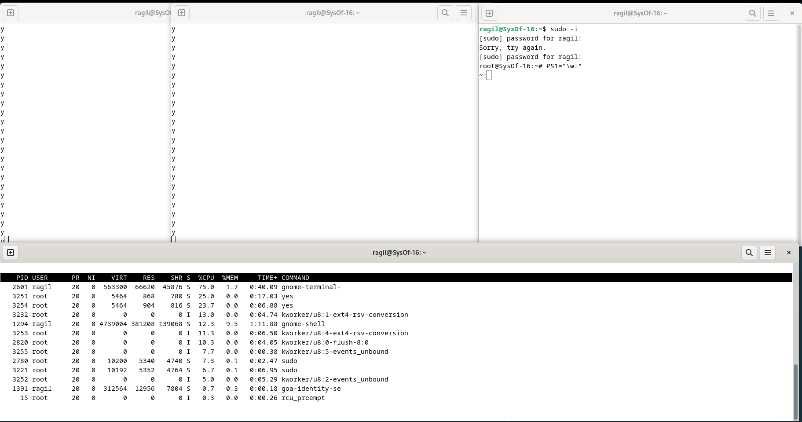

8. Ulangi langkah 7 untuk terminal 2.

   

9. Jendela Top akan menampilkan dua program `yes` sebagai proses yang berjalan. Nilai %CPU sama pada keduanya. Hal ini berarti kedua proses mengkonsumsi waktu proses yang sama dan berjalan sama cepat. PID dari kedua proses akan berbeda, misalnya 2713 dan 2715. Kemudiani gunakan terminal 3 (yang tidak menjalankan primes maupun Jendela Top) dan ketik `renice 19 <PID terminal 1>` (contoh: `renice 19 2713`) dan diikuti Enter. Hal ini berarti mengganti penjadwalan prioritas dari proses ke 19.

   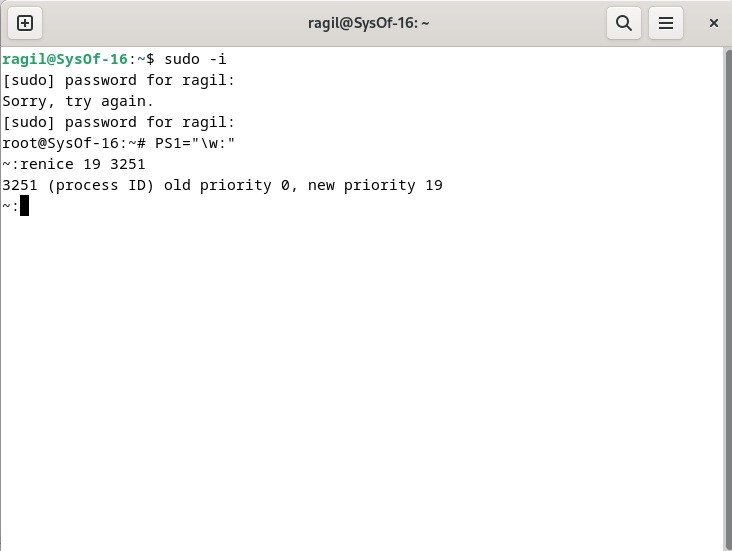

10. Tunggu beberapa saat sampai program top berubah dan terlihat pada jendela Top. Pada kolom STAT memperlihatkan N untuk proses 2713. Hal ini berarti bahwa penjadwalan prioritas untuk proses 2713 lebih besar (lebih lambat) dari 0. Proses 2715 berjalan lebih cepat.

11. Program top juga mempunyai fungsi yang sama dengan program `renice`. Pilih jendela Top dan tekan `r`. Program top terdapat prompt PID to renice: tekan 2713 (ingat bahwa Anda harus mengganti 2713 dengan PID Anda sendiri) dan tekan Enter. Program top memberikan prompt `Renice` PID 2713 to value: tekan -19 dan tekan Enter.

12. Tunggu beberapa saat sampai top berubah dan lihat nilai %CPU pada kedua proses. Sekarang proses 2713 lebih cepat dari proses 2715. Kolom status menunjukkan penjadwalan prioritas lebih rendah (lebih cepat) dari nilai 0.

    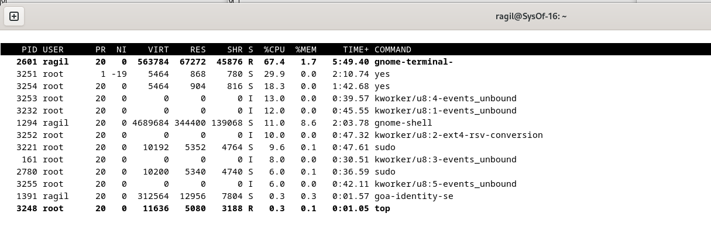

13. Pilih terminal 3 (yang sedang tidak menjalankan `yes` atau program top) dan ketik `nice -n -10 yes` dan Tekan Enter. Tunggu beberapa saat agar program top berubah dan akan terlihat proses primes ketiga. Misalnya PID nya 2714. Opsi -10 berada pada kolom NI (penjadwalan prioritas).

    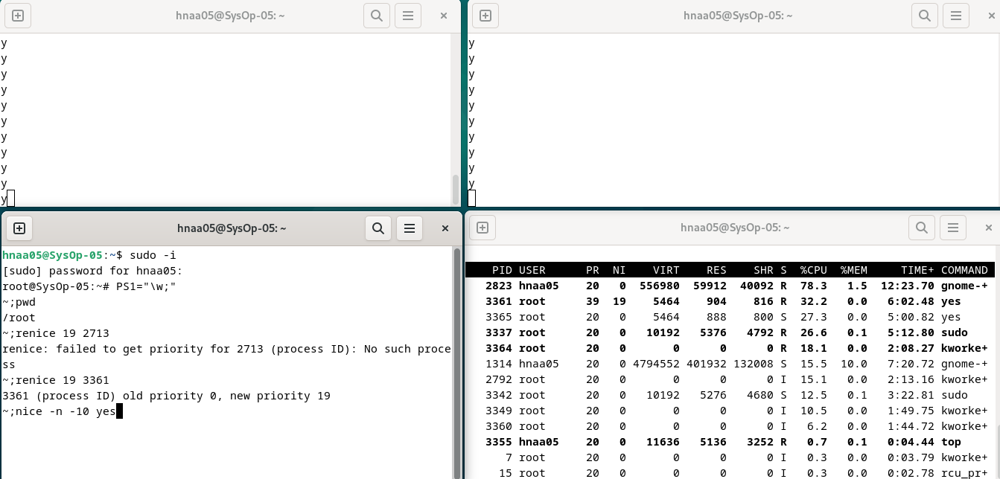

14. Jangan menggunakan mouse dan keyboard selama 10 detik. Program top menampilkan proses yang aktif selain program yes. Maka akan terlihat proses top terdaftar tetapi %CPU kecil (dibawah 1.0) dan konsisten. Juga terlihat proses berhubungan dengan dekstop grafis seperti X, panel dll.

    

15. Pindahkan mouse sehingga kursor berubah pada screen dan lihat apa yang terjadi dengan tampilan top. Proses tambahan akan muncul dan nilai %CPU berubah sebagai bagian grafis yang bekerja. Satu alasan adalah bahwa proses 2714 berjalan pada penjadwalan prioritas tinggi. Pilih jendela Top ketik `r`. PID to reniceL muncul prompt. Ketik 2714 (ubahlah 2714 dengan PID Anda) dan tekan Enter. Renice PID 2714 to value: muncul prompt. Ketik 0 dan tekan Enter. Sekarang pindahkan mouse ke sekeliling screen. Lihat perubahannya.

    

    

    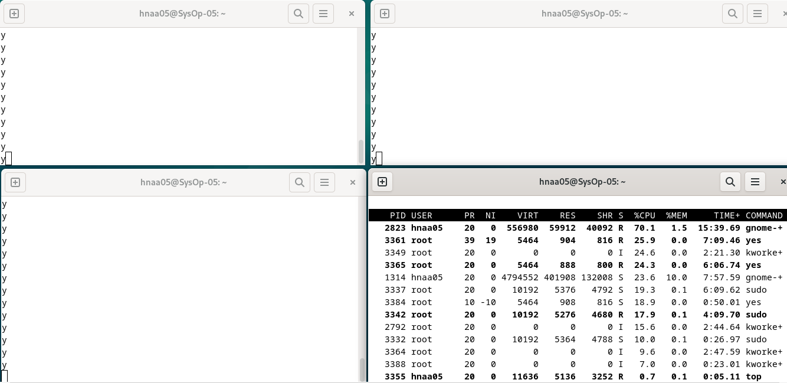

16. Tutup semua terminal window.
17. Logout dan login kembali sebagai user.

### Latihan

1. Masuk ke tty2 dengan Ctrl+Alt+F2. Ketik ps –au dan tekan Enter. Kemudian perhatikan keluaran sebagai berikut :

   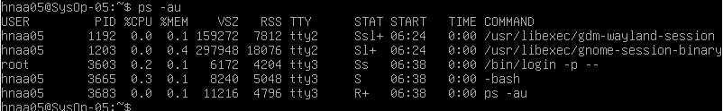

   - Sebutkan nama-nama proses yang bukan root

     - Semua proses kecuali `/bin/login -p--` adalah bukan root

   - Tulis PID dan COMMAND dari proses yang paling banyak menggunakan CPU time

     - PID : 4470
     - COMMAND : -bash

   - Sebutkan buyut proses dan PID dari proses tersebut

     - `/usr/libexec/gdm-wayland-session` dengan PID 3059

   - Sebutkan beberapa proses daemon

     - Pada beberapa proses yang tampil pada gambar di atas, tidak ada proses daemon.

   - Pada prompt login lakukan hal- hal sebagai berikut : `$ csh` `$ who` `$ bash` `$ ls` `$ sh` `$ ps`

     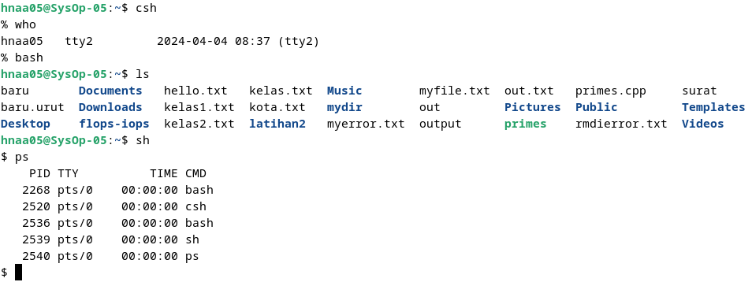

     Analisa :
     Perintah `$ bash` berfungsi untuk merubah perintah yang diinput menjadi kode biner yang dapat dipahami oleh kernel Linux. Sementara itu, perintah `$ ls` memperlihatkan seluruh file yang berada di direktori yang sedang dibuka, dan perintah `$ csh` merupakan sebuah shell interaktif yang menawarkan lebih banyak fitur sintaksis jika dibandingkan dengan Bourne Shell. Empat kolom utama yang ditampilkan oleh perintah ps adalah PID, TTY, TIME, dan CMD, yang menunjukkan informasi tentang proses yang berjalan di dalam sistem. Perintah `$ who` mengungkapkan siapa saja pengguna yang sedang log in ke dalam sistem, mencakup nama pengguna, terminal yang digunakan, waktu log in, serta detail lainnya. Fungsi ini kerap dimanfaatkan untuk memonitor penggunaan sistem dan mengetahui pengguna yang aktif.

   - Sebutkan PID yang paling besar dan kemudian buat urut-urutan proses sampai ke PPID = 1.

     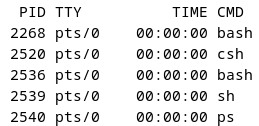

     - PID = 5204 (ps)
     - PID = 5203 (sh)
     - PID = 5200 (bash)
     - PID = 5198 (csh)
     - PID = 4752 (bash)

2. Cobalah format tampilan ps dengan opsi berikut dan perhatikan hasil tampilannya :

   - `-f` daftar penuh

   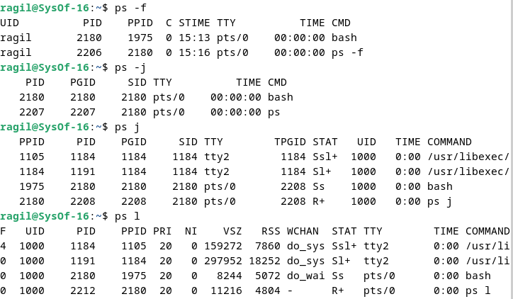

   Analisa : Hasil tampilan bisa ditunjukkan dalam bentuk detail atau lengkap dengan memilih opsi `-f`. Format ini umumnya mencakup informasi seperti nama pengguna yang menjalankan tugas, nomor identifikasi proses (PID), nomor identifikasi proses induk (parent PID), waktu dimulainya tugas, serta perintah yang dieksekusi.

   - `-j` format job

   

   Analisa : Informasi tentang pengendalian pekerjaan bagi tiap proses dapat dilihat menggunakan opsi -j. Dalam lingkungan Unix/Linux, terdapat suatu sistem yang disebut pengendalian pekerjaan, yang memfasilitasi pengguna dalam memantau dan mengelola proses yang aktif di terminal.
   - `j` format job control

   

   Analisa :

   - `l` daftar memanjang

   

   Analisa : Untuk menampilkan output yang lebih luas, opsi -l biasanya menyertakan informasi tambahan seperti nama lengkap pengguna yang menjalankan proses, perintah yang dijalankan, dan waktu mulai proses.

   - `s` format sinyal

   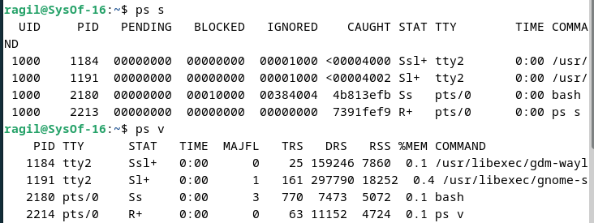

   Analisa : Opsi `s` dapat menampilkan informasi tentang sinyal yang dikirimkan kepada proses. Misalnya, jika Anda menggunakan `ps s`, Anda dapat melihat daftar sinyal yang telah dikirimkan kepada proses dengan ID proses (PID) tertentu.

   - `v` format virtual memory

   

   Analisa :Opsi `v` menampilkan informasi tentang penggunaan memori virtual oleh setiap proses. Ini mencakup ukuran memori virtual total yang dialokasikan, ukuran memori virtual yang saat ini digunakan, dan ukuran memori yang terlibat, yang merupakan memori yang diambil dari memori fisik.

   - `X` format register i386

   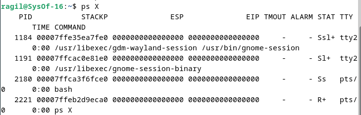

   Analisa : Semua proses, bahkan yang tidak terkait dengan terminal pengguna (tidak terkendali), dapat ditampilkan dengan opsi `X`.

3. Lakukan urutan pekerjaan berikut :

- Gunakan perintah `find` ke seluruh direktory pada sistem, belokkan output sehingga daftar direktori dialihkan ke file directories.txt dan daftar pesan error dialihkan ke file errors.txt

   
  

  Analisa : Instruksi `find` memiliki kemampuan untuk menjelajahi setiap sudut sistem dari direktori root (/). Jika ingin kompilasi semua direktori di sistem ke dalam satu file, output dari instruksi `find` bisa dialihkan ke `directories.txt`. Untuk menangani pesan kesalahan secara terpisah, gunakan `2>` untuk mengarahkan kesalahan ke file tersendiri, misalnya `errors`, sehingga memudahkan dalam menyimpan segala pesan kesalahan yang mungkin muncul.
- Gunakan perintah sleep 5. Apa yang terjadi dengan perintah ini ?

  

  Analisa : Perintah `sleep` digunakan dalam sistem operasi Unix/Linux untuk membuat proses tertunda, atau tidur, untuk jangka waktu tertentu (waktu yang telah dideklarasikan, semisal pada contoh diatas 5 => 5 second) sebelum melanjutkan eksekusi perintah berikutnya.

- Jalankan perintah pada background menggunakan &

  

  Analisa : Proses akan berjalan di background dengan nomor PID yang telah ditampilkan.

- Jalankan sleep 15 pada foreground, hentikan sementara dengan Ctrl-Z dan kemudian letakkan pada background dengan bg. Ketikkan jobs. Ketikkan ps. Kembalikan job ke foreground dengan perintah fg.

  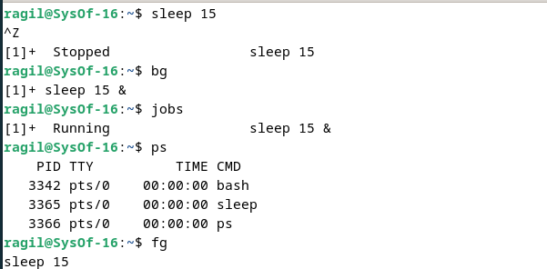

  Analisa : Langkah untuk menunda aktivitas selanjutnya selama 15 detik setelah ditangguhkan dapat dilihat di latar belakang dengan menggunakan perintah `bg`. Untuk mengetahui apakah terdapat pekerjaan yang berjalan saat ini, gunakan perintah `jobs`, yang akan menampilkan PID dan nama proses yang bersangkutan. Akhirnya, gunakan perintah `fg` untuk melanjutkan eksekusi proses `sleep 15`.

- Jalankan sleep 15 pada background menggunakan & dan kemudian gunakan perintah kill untuk menghentikan proses diikuti job number.

  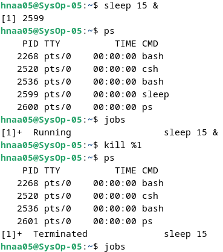

  Analisa : Menginisiasi penundaan selama 15 detik dan menempatkannya di latar belakang dengan perintah `sleep 15 &`. Selanjutnya, kita bisa memeriksa status proses dengan menggunakan perintah `ps` dan `jobs` untuk memastikan bahwa proses tersebut sedang berjalan di latar belakang. Untuk menghentikan proses, kita dapat menggunakan perintah `kill %1` dengan mengacu pada PID yang tercantum dalam perintah `jobs`. Setelah dihentikan, jika kita memeriksa dengan perintah `ps`, maka status proses `sleep 15` akan berubah dari `Running` menjadi `Terminated`.

- Jalankan sleep 15 pada background menggunakan & dan kemudian gunakan kill untuk menghentikan sementara proses. Gunakan bg untuk melanjutkan menjalankan proses.

  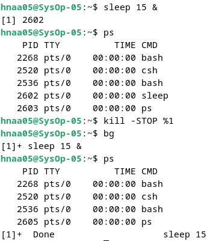

  Analisa : Menjalankan proses delay lagi selama 15 second pada background dengan perintah `sleep 15 &` lalu cek menggunakan perintah `ps` atau `jobs`, jalankan perintah `kill -STOP %1` untuk menghentikan proses sementara.

- Jalankan sleep 60 pada background 5 kali dan terminasi semua pada dengan menggunakan perintah killall.

  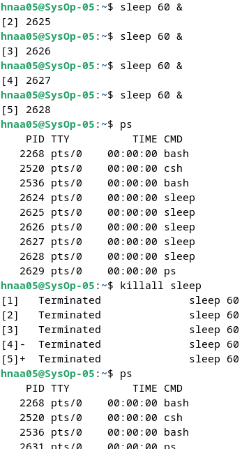

  Analisa : Melakukan penundaan selama 60 detik sebanyak 5 kali dengan menjalankan perintah `sleep 60 &` secara bersamaan dan memberikan PID untuk setiap proses. Gunakan perintah `ps` untuk memeriksa daftar proses yang sedang berjalan. Ketikkan `killall sleep` untuk menghentikan semua proses yang bernama sleep. Setelah itu, periksa kembali dengan menggunakan perintah `ps`, dan proses sleep tidak akan terdaftar karena telah dihentikan dan statusnya telah berubah menjadi terminated.

- Gunakan perintah ps, w dan top untuk menunjukkan semua proses yang sedang dieksekusi.

  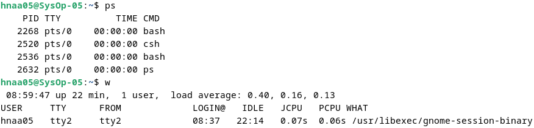

  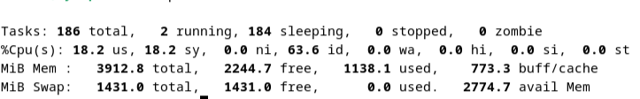

  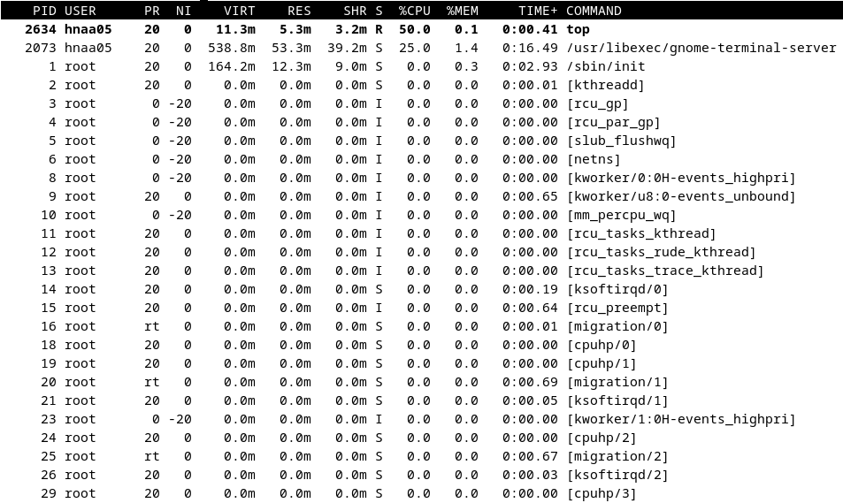

  Analisa : Dengan menggabungkan perintah ps aux, w, dan top, Anda dapat mendapatkan gambaran komprehensif tentang semua proses yang sedang berjalan pada sistem Linux. Ps aux akan memberikan rincian lengkap tentang setiap proses, termasuk PID, pengguna yang menjalankannya, dan penggunaan CPU. Di samping itu, w akan menampilkan aktivitas login pengguna, sementara top memberikan tampilan waktu nyata yang memungkinkan pemantauan langsung terhadap penggunaan CPU, memori, dan proses.
- Gunakan perintah ps –aeH untuk menampilkan hierarki proses. Carilah init proses. Apakah Anda bisa identifikasi sistem daemon yang penting ? Dapatkan Anda identifikasi shell dan subproses ?

  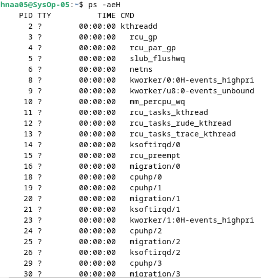

  - Init process adalah induk dari semua proses pada linux, ditandai dengan PID = 1 yaitu systemd.

  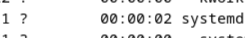

  - Sistem daemon yang penting disebut juga dengan init process dengan PID = 1. Selain itu, service deamon ditandai dengan huruf belakangnya d.

  

  - Untuk shell, terdapat di terminal yang sedang aktif (pts/1) yaitu proses seperti bash dan ps

  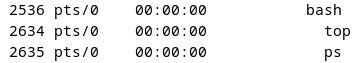

- Kombinasikan ps –fae dan grep, apa yang Anda lihat ?

  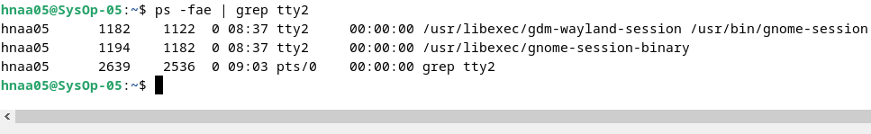

  Analisa : Gunakanlah perintah ps -fae untuk menampilkan semua proses yang sedang berlangsung di dalam sistem. Ketika dipasangkan dengan grep melalui pipelining, hanya proses yang sesuai dengan kriteria pencarian grep yang akan ditampilkan. Sebagai contoh, saya ingin menemukan proses yang sedang berjalan di tty2, yaitu terminal yang saya gunakan saat ini. Dengan menggunakan perintah ini, dapat diidentifikasi bahwa terdapat 2 proses yang sedang berjalan di tty2.

- Jalankan proses sleep 300 pada background. Log off komputer dan log in kembali. Lihat daftar semua proses yang berjalan. Apa yang terjadi pada proses sleep ?

  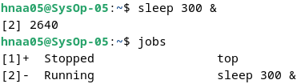

  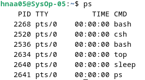

  Analisa : Proses sleep berhenti berjalan ketika tidak dalam status Running. Hal ini terjadi ketika pengguna keluar dari terminal, yang menyebabkan semua proses yang terkait dengan pengguna tersebut berhenti berjalan secara otomatis.
