## Daftar Isi

1. [Dasar Teori](#dasar-teori)

   - [Process - Fork - Multithread](#1-fork--parent---child-process)

2. [Soal No 1](#1-buat-tulisan-tentang-konsep-fork-dan-implementasinya-dengan-menggunakan-bahasa-pemrograman-c-minimal-2-paragraf-disertai-dengan-gambar)
3. [Soal No 2](#2-deskripsikan-dan-visualisasikan-pohon-proses-hasil-eksekusi-dari-kode-program-fork01c-fork02c-fork03c-fork04c-fork05cdan-fork06c)
4. [Soal No 3](#3-buatlah-program-perkalian-2-matriks-4-x-4-dalam-bahasa-c-yang-memanfaatkan-fork)

# Dasar Teori

## Process - Fork - Multithread

Setiap program atau bagian dari program yang sedang dieksekusi oleh CPU disebut dengan proses. Proses dapat berjalan secara _foreground_ atau _background_.

Untuk melihat seluruh proses yang sedang berjalan gunakan perintah `$ ps -e` .
Bisa juga menggunakan perintah `$pstree | more` untuk melihat secara detil proses yang sefan berjalan dengan format **tree**.

Setiap proses akan memilik **PID** Process ID). Apabila dibutuhkan Sebuah proses bisa memiliki proses anakan. Dalam hubungan tersebut proses dapat diibaratkan seperti orang tua (_parent_) dengan anak (_child_) yang turun temurun.

- Setiap proses memiliki parent dan child.
- Setiap proses memiliki ID (_pid_) dan parent ID (_ppid_), kecuali proses `init` atau `systemd`.
- _ppid_ dari sebuah proses adalah ID dari parent proses tersebut.

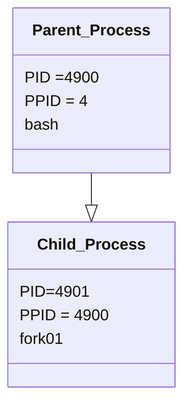

Perhatikan, ppid dari proses `fork01` adalah pid dari proses `bash`.

**fork** digunakan untuk menduplikasi proses. Proses yang baru disebut dengan child proses, sedangkan proses pemanggil disebut dengan parent proses. Spesifikasi fork bisa dilihat dengan `$ man 2 fork`.

```
int main() {
                            pid: 2308, ppid: 10
                             [Main process]
                                 |
  fork();              > Child process created <
                                 +
                               /   \
                             /       \
               pid: 2308, ppid: 10    pid: 30, ppid: 2308
                [Parent Process]    [Child Process]

  return 0;
}
```

perhatikan bahwa :

- `pid` Parent Process == `ppid` Child
- `child_id` Parent Process == `pid` Child Process

**Exec** adalah function yang digunakan untuk menjalankan program baru dan mengganti program yang sedang berlangsung. `exec` adalah program family yang memiliki berbagai fungsi variasi, yaitu `execvp`, `execlp`, `execv`, dan lain lain.

**wait** adalah function yang digunakan untuk mendapatkan informasi ketika child proses berganti _state_-nya. Pergantian state dapat berupa _termination_, _resume_, atau _stop_.

Manual: `$ man 3 exec`

  <hr>

### 1. Buat tulisan tentang konsep **fork** dan implementasinya dengan menggunakan bahasa pemrograman C! (minimal 2 paragraf disertai dengan gambar)

Fork merupakan salah satu konsep fundamental dalam sistem operasi Unix yang memungkinkan proses untuk membuat salinan dirinya sendiri. Dalam konteks bahasa pemrograman C, fungsi fork() digunakan untuk menciptakan proses baru yang disebut sebagai child process. Child process ini merupakan salinan identik dari proses parent yang memanggilnya, termasuk kode program dan lingkungan eksekusinya. Setelah proses child terbentuk, kedua proses (parent dan child) akan berjalan secara independen satu sama lain, memiliki ruang alamat memori yang terpisah, namun saling berbagi sumber daya sistem yang sama. Fork sangat berguna dalam paradigma pemrograman multiproses, memungkinkan aplikasi untuk melakukan tugas-tugas secara bersamaan atau paralel.

Implementasi fork dalam bahasa pemrograman C cukup sederhana. Berikut adalah contoh kode sederhana yang menggunakan fork untuk membuat proses child:
Source Code

    #include <sys/types.h>

    #include <unistd.h>
    #include <stdio.h>

    int main()
    {
    pid_t child_id;
    printf("This is the main program, with PID = %d, Child's ID = %d, Parent ID = %d\n",
    (int) getpid(), (int) child_id, (int) getppid());

        child_id = fork();
        if(child_id != 0){
          printf("This is the parent process, with PID = %d, Child's ID = %d, Parent ID = %d\n",
          (int) getpid(), (int) child_id, (int) getppid());
        } else {
          printf("This is the child process, with PID = %d, Child's ID = %d, Parent ID = %d\n",
          (int) getpid(), (int) child_id, (int) getppid());
        }

    }

Output

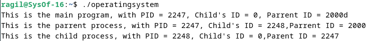


Gambar

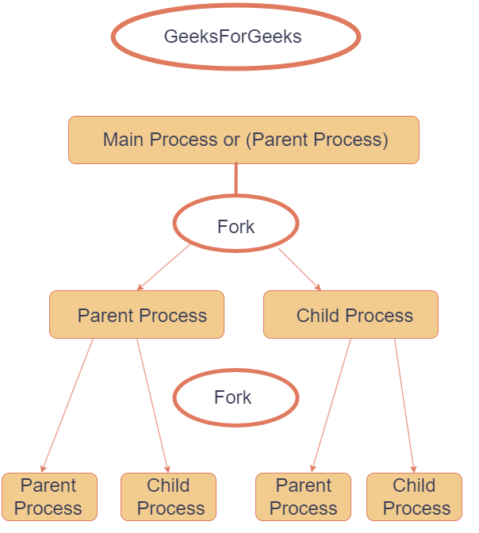

Analisa : Program ini mencetak informasi tentang PID (Process ID), Child ID, dan PPID (Parent Process ID) saat proses utama dipanggil dengan PID 2488 dan parent ID 2246. Saat proses utama menggunakan fungsi fork(), informasi tersebut dicetak dengan penjelasan yang menunjukkan proses induk dan anak, masing-masing memiliki PID dan PPID. Proses induk memiliki PID 2488 dan PPID 2246, sama dengan proses utama. Proses anak memiliki PID 2489 dan PPID 1130, dengan PID yang jelas lebih besar daripada proses induk.
### 2. Deskripsikan dan visualisasikan pohon proses hasil eksekusi dari kode program `fork01.c`, `fork02.c`, `fork03.c`, `fork04.c`, `fork05.c`dan `fork06.c`.

- `fork01.`

Source Code:

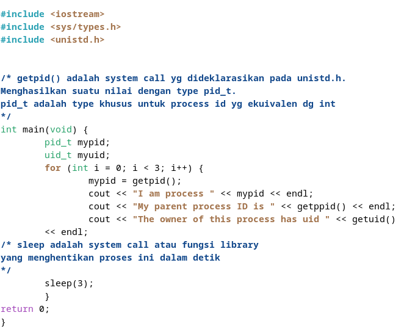

Output:

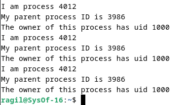

Visualisasi:

```
int main() {
  for(int i = 0;i < 3; i++){
    PID : 4012, PPID : 3986, uid : 1000
              [Main Process]
                    |
                sleep(3)
                    |
    PID : 4012, PPID : 3986, uid : 1000
              [Main Process]
                    |
                sleep(3)
                    |
    PID : 4012, PPID : 3986, uid : 1000
              [Main Process]
                    |
                sleep(3)
  }
}
```

Analisa: Tampilan di atas menunjukkan bahwa program sedang melakukan proses forking berulang, menghasilkan sejumlah besar proses anak yang memiliki identitas yang berbeda-beda. Setiap proses mencatat PID (Process ID) dan PPID (Parent Process ID) miliknya, serta UID (User ID) yang sama untuk pemilik proses. Ini mencerminkan prinsip dasar dari panggilan sistem "fork" di mana sistem operasi menciptakan salinan dari proses yang sedang berjalan.
- `fork02.`

Source Code:

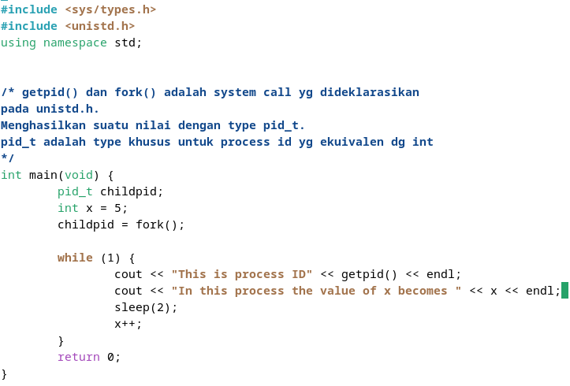

Output:

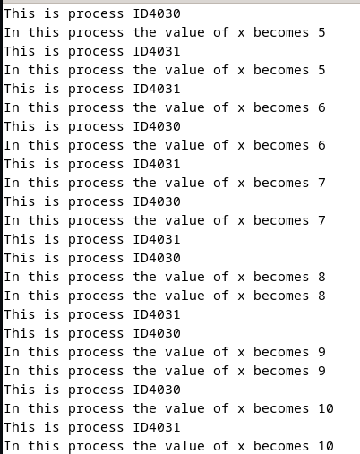

Visualisasi:

```
int main() {
  fork();         > Child process created <
                              +
                            /   \
                          /       \
                        /           \
  while(1){           /               \
          PID: 4030, PPID: -       PID: 4031, PPID: 4030
          [Parent Process]          [Child Process]
                      \               /
                        \           /
                          \       /
                            \   /
                              |
                          sleep(2)
                              |
                             x++
  }
}
```

Analisa: Output di atas menunjukkan bahwa aplikasi ini memanfaatkan sistem pemanggilan fork untuk menciptakan cabang-cabang proses. Tiap anak proses memiliki variabel "x" masing-masing yang independen dari yang lainnya.

- `fork03.`

Source Code:

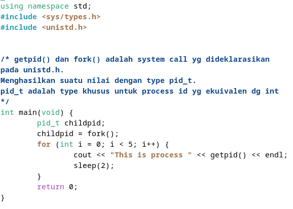

Output:

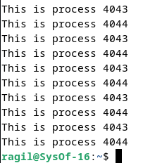

Visualisasi:

```
int main() {
      fork();         > Child Process created <
                              +
                            /   \
                          /       \
  x=5;                  /           \
  while(x<=5){        /               \
          PID: 4043, PPID: -      PID: 4044, PPID: 4043
          [Parent Process]          [Child Process]
                      \               /
                        \           /
                          \       /
                            \   /
                              |
                          sleep(2)
                              |
                            x++
  }
}
```

Analisa: Program di atas melakukan pengulangan proses forking, menghasilkan proses-proses baru dengan pesan yang mencatat ID unik dari setiap proses (PID). Kehadiran beberapa PID yang serupa menunjukkan bahwa proses induk melakukan forking beberapa kali, menciptakan proses-proses anak dengan PID yang sama.

- `fork04.`

Source Code:

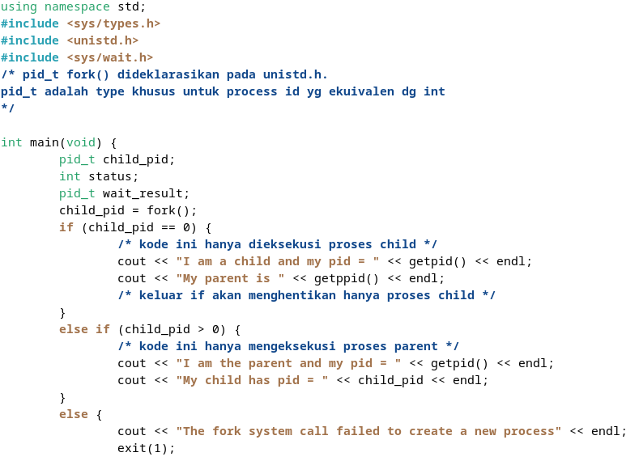

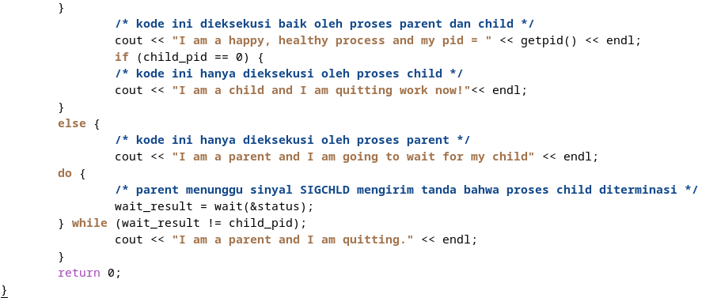

Output:

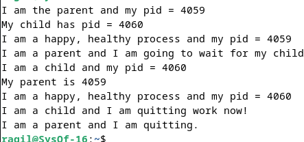

Visualisasi:

```
int main() {
  fork();               > Child process created <
                                    +
                                  /   \
                                 /     \
                                /       \
                               /         \
                    PID: 4059, PPID: -    \
                    [Parent Process]       \
                            |               \
                            |                \
                            |        PID: 4060, PPID: 4059
                          wait         [Child Process]
                            \                /
                              \            /
                                \        /
                                  \    /
                                    \/
                                   exit
}
```

Analisa: Program tersebut melakukan proses fork untuk menciptakan proses anak. Proses induk mencetak pesan yang menunjukkan identitasnya, yaitu "I am the parent and my pid = 3408", di mana 3408 adalah PID dari proses induk itu sendiri. Sementara proses anak mencetak pesan "My parent is 3408" diikuti dengan PID-nya sendiri, yaitu "I am a child and my pid = 3409". Keduanya kemudian mencetak pesan yang serupa. Proses anak kemudian memberikan pesan penutup "I am a child and I am quitting work now!" untuk menandakan berhentinya prosesnya. Proses induk menyusul dengan mencetak pesan "I am the parent and I am quitting".

- `fork05.`

Source Code:

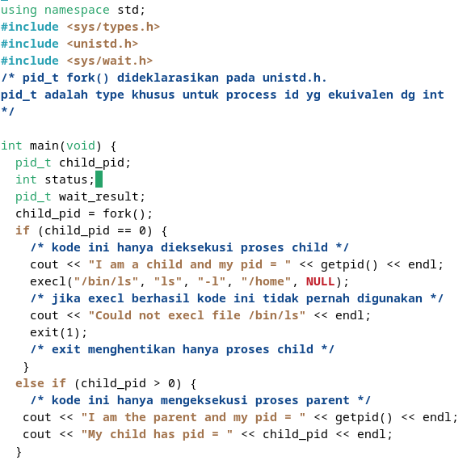

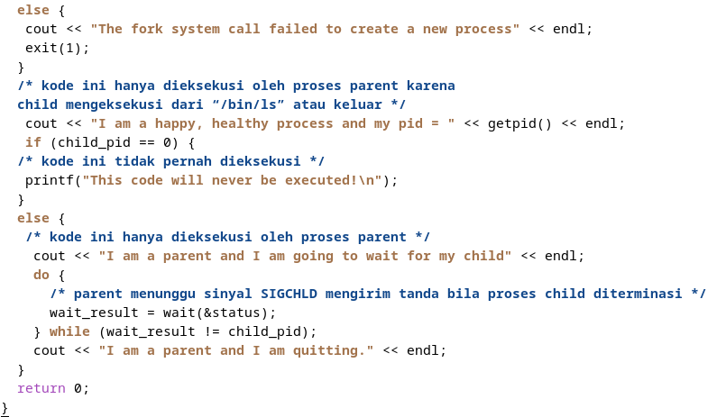

Output:

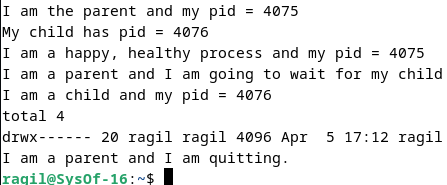

Visualisasi:

```
int main() {
  fork();                > Child process created <
                                    +
                                  /   \
                                /       \
                PID : 4075 PPID : -       \
                 [Parent Process]           \
                        |                     \
                        |                       \
                        |               PID : 4076 PPID : 4075
                      wait                    execl(/bin/ls)
                        \                     [Child Process]
                          \                       /
                            \                   /
                              \               /
                                \           /
                                  \       /
                                    \   /
                                      |
                                    exit
}
```

Analisa: Program di bawah ini adalah sebuah contoh implementasi `fork()` dengan dua proses yang saling terhubung. Proses pertama memiliki ID proses (PID) 7216 dan ID proses induk (PPID) yang tidak diketahui pada awalnya, yang merujuk kepada proses utama (biasanya program utama atau induk). Ketika program dijalankan dan fungsi fork() dipanggil, akan tercipta proses baru dengan PID 7217 dan PPID 7216. Setelah itu, program induk akan mencetak output yang menampilkan nomor PID dan PID anak. Kemudian, program induk akan menunggu hingga proses anak selesai dieksekusi. Saat proses anak selesai dan mencetak output yang menampilkan nomor PID dan PID induknya, program induk akan segera keluar dari proses. Setelah proses anak selesai dieksekusi dan keluar dari proses, barulah program induk juga akan keluar dari prosesnya.

- `fork06.`

Source Code:

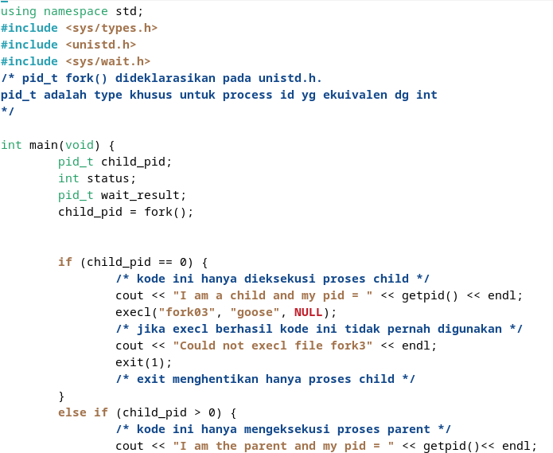

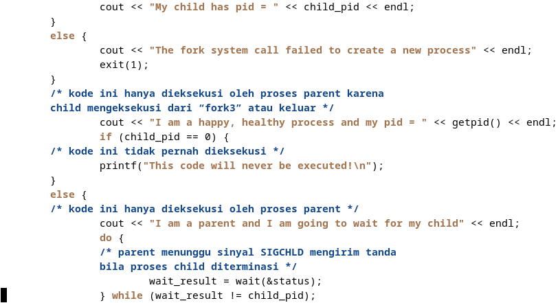

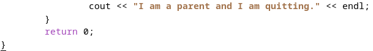

Output:

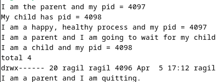

Visualisasi:

```
int main() {
  fork();           > Child process created <
                                +
                              /   \
                            /      \
              PID: 4097, PPID: -    \
              [Parent Process]       \
                      |               \
                      |          PID: 4098, PPID: 4097
                    wait          [Child Process]
                      \               /
                        \           /
                          \       /
                            \   /
                              |
                            exit
}
```

Analisa: Proses induk mencetak pesan yang menyatakan identitasnya sebagai "I am the parent and my pid = 6875", di mana 6875 adalah PID dari proses induk itu sendiri. Sementara itu, proses anak mencetak pesan "My parent is 6875" diikuti dengan PID-nya sendiri, yaitu "I am a child and my pid = 6876". Keduanya juga mencetak pesan yang menunjukkan bahwa mereka adalah proses yang sehat dan bahagia dengan PID masing-masing. Kemudian, kedua proses terus mencetak pesan "This is process XXXX", di mana XXXX menunjukkan PID masing-masing proses, menunjukkan iterasi dalam siklus kerjanya. Akhirnya, proses induk mengakhiri eksekusinya dengan mencetak pesan "I am the parent and I am quitting.".

### 3. Buatlah program perkalian 2 matriks [4 x 4] dalam bahasa C yang memanfaatkan `fork()`.

* Source Code

#include <stdio.h>
#include <unistd.h>
#include <sys/wait.h>

#define SIZE 4

    void multiplyMatrices(int mat1[SIZE][SIZE], int mat2[SIZE][SIZE], int result[SIZE][SIZE]) {
    for (int i = 0; i < SIZE; i++) {
        for (int j = 0; j < SIZE; j++) {
            result[i][j] = 0;
            for (int k = 0; k < SIZE; k++) {
                result[i][j] += mat1[i][k] * mat2[k][j];
          }
        }
      }
    }

    void printMatrix(int mat[SIZE][SIZE]) {
    for (int i = 0; i < SIZE; i++) {
        for (int j = 0; j < SIZE; j++) {
            printf("%d ", mat[i][j]);
        }
        printf("\n");
    }
    }

    int main() {
    int mat1[SIZE][SIZE] = {{1, 2, 3, 4},
                          {5, 6, 7, 8},
                          {9, 10, 11, 12},
                          {13, 14, 15, 16}};
    int mat2[SIZE][SIZE] = {{2, 0, 0, 2},
                            {0, 3, 0, 0},
                            {0, 0, 4, 0},
                            {2, 0, 0, 5}};
    int result[SIZE][SIZE];

    pid_t pid;
    pid = fork();

    if (pid == 0) { // Child process
        multiplyMatrices(mat1, mat2, result);
        printf("Child Process Result:\n");
        printMatrix(result);
    } else if (pid > 0) { // Parent process
        wait(NULL);
        printf("Parent Process Result:\n");
        multiplyMatrices(mat1, mat2, result);
        printMatrix(result);
    } else { // Fork failed
        printf("Fork failed!\n");
        return 1;
    }

    return 0;
}

* Output

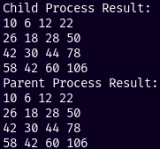

Analisa: Kode di atas merupakan sebuah program perkalian 2 matriks [4 x 4] dalam bahasa C yang menggunakan fork() untuk melakukan proses multiproses.

Fork Process: Setelah menginisialisasi matriks, program melakukan fork untuk menciptakan proses anak. Proses anak akan mengalikan setiap elemen matriks dengan skalar, sedangkan proses induk akan menunggu proses anak selesai.

Serial Processing: Meskipun perkalian skalar dilakukan secara paralel oleh proses anak, program menunggu proses anak selesai sebelum melanjutkan eksekusi. Ini dilakukan dengan menggunakan fungsi wait(), sehingga proses induk akan menunggu sampai proses anak selesai sebelum mencetak pesan bahwa proses induk telah selesai.
