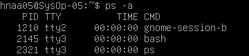

## Proses dan Manajemen Proses

### POKOK BAHASAN

- Proses pada Sistem Operasi Linux
- Manajemen Proses pada Sistem Operasi Linux

### TUJUAN BELAJAR

Setelah mempelajari materi dalam bab ini, mahasiswa diharapkan mampu:

- Memahami konsep proses pada sis tem operasi Linux.
- Menampilkan beberapa cara menampilkan hubungan proses parent dan child.
- Menampilkan status proses dengan beberapa format berbeda.
- Melakukan pengontrolan proses pada shell.
- Memahami penjadwalan prioritas.

### DASAR TEORI

#### 1. KONSEP PROSES PADA SISTEM OPERASI LINUX

Proses adalah program yang sedang dieksekusi. Setiap kali menggunakan utilitas sistem atau program aplikasi dari shell, satu atau lebih proses ”child” akan dibuat oleh shell sesuai perintah yang diberikan. Setiap kali instruksi dibe rikan pada Linux shell, maka kernel akan menciptakan sebuah proses-id. Proses ini disebut juga dengan terminology Unix sebagai sebuah Job. Proses Id (PID) dimulai dari 0, yaitu proses INIT, kemudian diikuti oleh proses berikutnya (terdaftar pada /etc/inittab).
Beberapa tipe proses :

- Foreground  
  Proses yang diciptakan oleh pemakai langsung pada terminal (interaktif, dialog)
- Batch  
  Proses yang dikumpulkan dan dijalankan secara sekuensial (satu persatu). Prose Batch tidak diasosiasikan (berinteraksi) dengan terminal.
- Daemon  
  Proses yang menunggu permintaan (request) dari proses lainnya dan menjalankan tugas sesuai dengan permintaan tersebut. Bila tidak ada request, maka program ini akan berada dalam kondisi “idle” dan tidak menggunakan waktu hitung CPU. Umumnya nama proses daemon di UNIX berakhiran d, misalnya inetd, named, popd dll

#### 2. SINYAL

Proses dapat mengirim dan menerima sinyal dari dan ke proses lainnya. Proses mengirim sinyal melalui instruksi “kill” dengan format  

    kill [-nomor sinyal] PID

Nomor sinyal : 1 s/d maksimum nomor sinyal yang didefinisikan system Standar nomor sinyal yang terpenting adalah :

| No Sinyal | Nama    | Deskripsi                                                                             |
| --------- | ------- | ------------------------------------------------------------------------------------- |
| 1         | SIGHUP  | Hangup, sinyal dikirim bila proses terputus, misalnya melalui putusnya hubungan modem |
| 2         | SIGINT  | Sinyal interrupt, melalui ^C                                                          |
| 3         | SIGQUIT | Sinyal Quit, melalui ^\|                                                              |
| 9         | SIGKILL | Sinyal Kill, menghentikan proses                                                      |
| 15        | SIGTERM | Sinyal terminasi software                                                             |

#### 3. MENGIRIM SINYAL

Mengirim sinyal adalah satu alat komunikasi antar proses, yaitu memberitahukan proses yang sedang berjalan bahwa ada sesuatu yang harus dikendalikan. Berdasarkan sinyal yang dikirim ini maka proses dapat bereaksi dan administrator/programmer dapat menentukan reaksi tersebut. Mengirim sinyal menggunakan instruksi

    kill [-nomor sinyal] PID

Sebelum mengirim sinyal PID proses yang akan dikirim harus diketahui terlebih dahulu.

#### 4. MENGONTROL PROSES PADA SHELL

Shell menyediakan fasilitas job control yang memungkinkan mengontrol beberapa job atau proses yang sedang berjalan pada waktu yang sama. Misalnya bila melakukan pengeditan file teks dan ingin melakukan interrupt pengeditan untuk mengerjakan hal lainnya. Bila selesai, dapat kembali (switch) ke editor dan melakukan pengeditan file teks kembali. 
Job bekerja pada <strong>foreground</strong> atau <strong>background</strong>. Pada foreground hanya diper untukkan untuk satu job pada satu waktu. Job pada foreground akan mengontrol shell - menerima input dari keyboard dan mengirim output ke layar. Job pada background tidak menerima input dari terminal, biasanya berjalan tanpa memerlukan interaksi 
Job pada foreground kemungkinan dihentikan sementara (suspend), dengan menekan [Ctrl-Z]. Job yang dihentikan sementara dapat dijalankan kembali pada foreground atau background sesuai keperluan dengan menekan <strong>”fg”</strong> atau <strong>”bg”</strong>. Sebagai catatan, menghentikan job seme ntara sangat berbeda dengan melakuakan interrupt job (biasanya menggunakan [Ctrl-C]), dimana job yang diinterrup akan dimatikan secara permanen dan tidak dapat dijalankan lagi.

#### 5. MENGONTROL PROSES LAIN

Perintah ps dapat digunakan untuk menunjukkan semua proses yang sedang berjalan pada mesin (bukan hanya proses pada shell saat ini) dengan format :

    ps –fae atau
    ps -aux

Beberapa versi UNIX mempunyai utilitas sistem yang disebut top yang menyediakan cara interaktif untuk memonitor aktifitas sistem. Statistik secara detail dengan proses yang berjalan ditampilkan dan secara terus-menerus di-refresh . Proses ditampilkan secara terurut dari utilitas CPU. Kunci yang berguna pada top adalah

    s – set update frequency
    u – display proses dari satu user
    k – kill proses (dengan PID)
    q – quit

Utilitas untuk melakukan pengontrolan proses dapat ditemukan pada sistem UNIX adalah perintah killall. Perintah ini akan menghentikan proses sesuai PID atau job number proses.

#### TUGAS PENDAHULUAN :

Jawablah pertanyaan-pertanyaan di bawah ini :

1.  Apa yang dimaksud dengan proses ?

        Proses adalah program yang sedang dieksekusi.

2.  Apa yang dimaksud perintah untuk menampilkan status proses : ps,pstree

        - Ps adalah Perintah yang dapat digunakan untuk menunjukkan semua proses yang sedang berjalan pada mesin (bukan hanya proses pada shell saat ini). Instruksi ps (processstatus) digunakan untuk melihat kondisi proses yang ada.

        - Pstree Sama halnya dengan perintah ps. Pstree juga mempunyai fungsi yang sama untuk melihat status proses yang berjalan pada sistem. Tetapi informasinya di perlihat dengan bentuk tree (pohon)

3.  Sebutkan opsi yang dapat diberikan pada perintah ps

        a. $ ps -u
        Untuk melihat faktor/elemen lainnya, gunakan option –u (user). %CPU adalah presentasi CPU time yang digunakan oleh proses 
        tersebut, %MEM adalah presentasi system memori yang digunakan proses, SIZE adalah jumlah memori yang digunakan, RSS (Real System 
        Storage) adalah jumlah memori yang digunakan, START adalah kapan proses tersebut diaktifkan.

        b. $ ps –u
        Mencari proses yang spesifik pemakai. Proses diatas hanya terbatas pada proses milik pemakai, dimana pemakai teresbut melakukan 
        login.

        c. $ ps –a
           $ ps –au
        Mencari proses lainnya gunakan opsi a (all) dan au (all user).

        d. $ ps –eH
        Opsi e memilih semua proses dan opsi H menghasilkan tampilan proses secara hierarki. Proses child muncul dibawah prosesparent. 
        Proses child ditandai dengan awalan beberapa spasi.

        e. $ ps –e fTampilan serupa dengan langkah 2. Opsi –f akan menampilkan status proses dengan karakter grafis (\ dan _).

        f. $ pstree+
        Akan ditampilkan semua proses pada sistem dalam bentuk hirarki parent/child. Proses parent di sebelah kiri proses child. Sebagai 
        contoh proses init sebagai parent (ancestor) dari semua proses pada sistem. Beberapa child dari init mempunyai child. Proses 
        login mempunyai proses bash sebagai child. Proses bash mempunyai proses child startx. Proses startx mempunyai child xinit dan 
        seterusnya.

        g. $ pstree | grep mingetty
        Akan menampilkan semua proses mingetty yang berjalan pada system yang berupa console virtual. Selain menampikan semua proses, 
        proses dikelompokkan dalam satu baris dengan suatu angka sebagai jumlah proses yang berjalan.

        h. $ pstree –p
        Untuk melihat semua PID untuk proses gunakan opsi –p.

        i. $ pstree –h
        Untuk menampilk an proses dan ancestor yang tercetak tebal gunakan opsi –h.

        j. $ ps –e | more
        Opsi -e menampilkan semua proses dalam bentuk 4 kolom : PID, TTY, TIME dan CMD.

        k. $ ps ax | more
        Opsi a akan menampilkan semua proses yang dihasilkan terminal (TTY). Opsi x menampilkan semua proses yang tidak dihasilkan 
        terminal. Secara logika opsi ini sama dengan opsi –e . Terdapa 5 kolom : PID, TTY, STAT, TIME dan COMMAND.

        l. $ ps ef | more
        Opsi –e f akan menampilkan semua proses dalam format daftar penuh.

        m. $ ps –eo pid,cmd | moreOpsi –eo akan menampilkan semua proses dalam format sesuai definisi user yaitu terdiri dari kolom PID 
        dan CMD.

        n. $ ps –eo pid,ppid,%mem,cmd | more
        Akan menampilkan kolom PID, PPID dan %MEM. PPID adalah proses ID dari proses parent. %MEM menampilkan persentasi memory system 
        yang digunakan proses. Jika proses hanya menggunakan sedikit memory system akan dita mpilkan 0.

4.  Apa yang dimaksud dengan sinyal?Apa perintah untuk mengirim sinyal?
   
        Sinyal adalah pesan yang dikirim oleh sistem operasi atau proses lain ke proses atau thread untuk memberikan notifikasi atau 
        meminta tindakan tertentu. Proses dapat mengirim dan menerima sinyal dari dan ke proses lainnya.
        Proses mengirim sinyal melalui instruksi “kill” dengan format kill [-nomor sinyal] PID

5.  Apa yang dimaksud dengan proses foreground dan background pada job control

       a. Job pada foreground adalah roses yang diciptakan oleh pemakai langsung pada terminal (interaktif, dialog). Pada foreground 
       hanya diperuntukkan untuk satu job pada satu waktu. Job pada foreground akan mengontrol shell menerima input dari keyboard dan 
       mengirim output ke layar.

       b. Job pada background tidak menerima input dari terminal, biasanya berjalan tanpa memerlukan interaksi.

6.  Apa yang dimaksud perintah - perintah penjadwalan prioritas :

        a. Top : Memonitor aktifitas system.

        b. Nice : mengubah prioritas pada proses.

        c. Renice : mengurangi prioritas pada proses.

#### PERCOBAAN:

1.  Login sebagai user.

    

2.  Download program C++ untuk menampilkan bilangan prima yang bernama
    primes.

    

        Analisa:

        Program ini menampilkan serangkaian bilangan prima hingga mencapai batas N yang ditentukan oleh pengguna. Setelah dijalankan, program akan meminta input N dari pengguna dan menampilkan deret bilangan prima sesuai dengan batas yang ditentukan.

3.  Lakukan percobaan-percobaan di bawah ini kemudian analisa hasil percobaan.
4.  Selesaikan soal-soal latihan.

#### Percobaan 1 : Status Proses

6.  Pindah ke command line terminal (tty2) dengan menekan Ctrl+Alt+F2
    dan login ke terminal sebagai user.

    

        Analisa:

        Saat pertama kali masuk ke terminal, pengguna akan diarahkan untuk melakukan proses login dengan memasukkan username dan password. Hanya setelah berhasil login, pengguna dapat mengakses command line sebagai user. Jika password yang dimasukkan salah, pengguna akan terus diminta untuk melakukan login tanpa dapat mengakses command line.

7.  Instruksi ps (process status) digunakan untuk melihat kondisi proses yang ada. PID adalah Nomor Identitas Proses, TTY adalah nama terminal dimana proses tersebut aktif, STAT berisi S (Sleepin g) dan R (Running), COMMAND merupakan instruksi yang digunakan.

    `$ ps`

    

        Analisa:

        Anda dapat menggunakan perintah 'ps' untuk memeriksa daftar proses yang sedang berjalan di sistem. Saat ini, hanya ada dua proses yang berjalan, yaitu 'bash' dan 'ps' itu sendiri. Setiap proses memiliki sebuah nomor identifikasi unik yang disebut sebagai PID. 'Bash' merupakan singkatan dari Bourne Again Shell yang berfungsi sebagai interpreter antara pengguna dan kernel sistem.

8.  Untuk melihat fak tor/elemen lainnya, gunakan option –u (user). %CPU adalah presentasi CPU time yang digunakan oleh proses tersebut, %MEM adalah presentasi system memori yang digunakan proses, SIZE adalah jumlah memori yang digunakan, RSS (Real System Storage) adalah jumlah memori yang digunakan, START adalah kapan proses tersebut diaktifkan

    `$ ps -u`

    

        Analisa :

       Gunakan perintah `ps -u` untuk menampilkan daftar semua proses yang sedang dijalankan oleh pengguna pada seluruh terminal yang aktif.

9.  Mencari proses yang spesifik pemakai. Proses diatas hanya terbatas pada proses milik pemakai, dimana pemakai teresbut melakukan login

    `$ ps –u < user >`

    

10. Mencari proses lainnya gunakan opsi a (all) dan au (all user)

    `$ ps –a`

    

    `$ ps –au`

    

11. Logout dan tekan Alt+F7 untuk kembali ke mode grafis

    

#### Percobaan 2 : Menampilkan Hubungan Proses Parent dan Child

1.  Pindah ke command line terminal (tty2) dengan menekan Ctrl+Alt+F2 dan login ke terminal sebagai user.

    

        Analisa:

        Saat pertama kali masuk ke terminal, pengguna akan langsung diminta untuk memasukkan informasi login dan password. Setelah autentikasi berhasil, barulah pengguna dapat mengakses command line sebagai user. Jika password yang dimasukkan salah, pengguna tidak akan dapat mengakses command line dan akan terus diminta untuk melakukan proses login ulang.
2.  Ketik ps –eH dan tekan Enter. Opsi e memilih semua proses dan opsi H menghasilkan tampilan proses secara hierarki. Proses child muncul dibawah proses parent. Proses child ditandai dengan awalan beberapa spasi.

    `$ ps -eH`

    
    
        Analisa:

        Tampilkan semua proses dalam daftar dengan menggunakan perintah `$ ps -eH`, yang akan menampilkan hierarki perintah. Pada nama CMD anak, terdapat spasi di depannya. Tulisan di sisi kanan kolom CMD akan terindendasi, sesuai dengan contoh yang diberikan pada gambar.

3.  Ketik ps –e f dan tekan Enter. Tampilan serupa dengan langkah 2. Opsi
    –f akan menampilkan status proses dengan karakter grafis (\ dan \_)

    `$ ps –e f`

    

        Analisa:

       Instruksi ini serupa dengan yang sebelumnya, namun proses anaknya ditandai dengan simbol grafis (\_) alih-alih menggunakan spasi. Sebagai contoh, ketika perintah /bin/login -p dijalankan, proses anaknya akan ditampilkan sebagai -bash, dan perintah -bash akan menimbulkan proses anak ps -e f.

4.  Ketik pstree dan tekan Enter. Akan ditampilkan semua proses pada sistem dalam bentuk hirarki parent/child. Proses parent di sebelah kiri proses child. Sebagai contoh proses init sebagai parent (ancestor) dari semua proses pada sistem. Beberapa child dari init mempunyai child. Proses login mempunya i proses bash sebagai child. Proses bash mempunyai proses child startx. Proses startx mempunyai child xinit dan seterusnya.

    `$ pstree`

    

        Analisa:

        Dengan menggunakan instruksi ini, segala perintah akan dipresentasikan dalam struktur seperti pohon, dengan garis yang menghubungkan antara satu perintah dan yang lainnya. Pendekatan ini membantu memvisualisasikan hubungan antara proses induk (parent) dan anak (child) dengan jelas. Setiap proses anak akan terletak lebih ke kanan dari proses induknya, dengan garis yang menghubungkan keduanya.

5.  Ketik pstree | grep mingetty dan tekan Enter. Akan menampilkan semua proses mingetty yang berjalan pada system yang berupa console virtual. Selain menampikan semua proses, proses dikelompokkan dalam satu baris dengan suatu angka sebagai jumlah proses yang berjalan.

    `$ pstree | grep mingetty`

    

        Analisa:

        Dengan menggunakan perintah yang disediakan, saya dapat menampilkan daftar proses yang sedang berjalan pada console virtual. Namun, mengingat tidak ada program mingetty terpasang dalam sistem operasi saya, outputnya akan kosong.

6.  Untuk melihat semua PID untuk proses gunakan opsi –p.

    `$ pstree –p`

    

        Analisa:

        Cara pengaturan perintah ini mirip dengan apa yang dipraktikkan dalam bagian 5 dari sesi praktikum, di mana data disajikan dalam bentuk struktur diagram atau pohon. Namun, dalam instruksi ini, informasi tentang PID proses yang dipakai hanya diperluas dengan menggunakan opsi "-p".

7.  Untuk menampilk an proses dan ancestor yang tercetak tebal gunakan opsi
    –h.

    `$ pstree –h`

    

        Analisa:

        Perintah "pstree" telah diperbarui dengan tambahan opsi "-h", yang memungkinkan untuk menampilkan proses dan leluhur mereka dengan cetakan tebal atau penyorotan.

#### Percobaan 3 : Menampilkan Status Proses dengan Berbagai Format

8.  Pindah ke command line terminal (tty2) dengan menekan Ctrl+Alt+F2 dan login ke terminal sebagai user.

    

        Analisa:

        Saat masuk ke terminal, pengguna akan diminta untuk melakukan login dengan menyediakan kredensial yang tepat. Setelah login berhasil, akses ke command line akan diberikan. Namun, jika kredensial yang diberikan tidak valid, akses ke command line akan ditolak dan pengguna akan terus diarahkan kembali untuk melakukan login.

9. Ketik ps –e | more dan tekan Enter. Opsi -e menampilkan semua proses dalam bentuk 4 kolom : PID, TTY, TIME dan CMD.

    `$ ps –e | more`

    

    Jika halaman penuh terlihat prompt --More-- di bagian bawah screen, tekan q untuk kembali ke prompt perintah.

        Analisa:

        Percobaan ini bertujuan untuk menampilkan urutan lengkap dari semua instruksi/perintah, dimulai dari nomor 1, dalam satu tampilan penuh (gunakan perintah $ more). Dalam gambar yang diberikan, pada bagian tty ditandai dengan tanda tanya, menunjukkan bahwa perintah tersebut tidak sedang aktif di terminal mana pun.

10. Ketik ps ax | more dan tekan Enter. Opsi a akan menampilkan semua proses yang dihasilkan terminal (TTY). Opsi x menampilkan semua proses yang tidak dihasilkan terminal. Secara logika opsi ini sama dengan opsi –e . Terdapa 5 kolom : PID, TTY, STAT, TIME dan COMMAND.

    `$ ps ax | more`

    

    Jika halaman penuh terlihat prompt --More-- di bagian bawah screen, tekan q untuk kembali ke prompt perintah.

        Analisa:

        3. Perintah ini menghasilkan output yang serupa dengan yang disebutkan sebelumnya, namun yang membedakan adalah jenis kolom yang ditampilkan, yang berjumlah lima, yaitu PID, tty, Stat, time, dan CMD. Di sini, TIME mengacu pada durasi yang dibutuhkan oleh CPU untuk mengeksekusi perintah atau aplikasi tertentu. STAT merupakan singkatan dari status proses, dengan kode-kode sebagai berikut:

        D uninterruptible sleep (biasanya IO)
        R proses sedang berjalan/dapat dijalankan (saat masuk queue/antrian)
        S sleep dan sedang menunggu event selesai
        T Diberhentikan oleh job kontrol
        Z Zombi process karena tidak diberhentikan oleh induk process
        < proses dengan prioritas tinggi
        N proses dengan prioritas rendah
        L process telah dikunci dalam memory untuk process realtime dan custom IO
        s Session leader
        l Multi threaded menggunakan CLONE_THREAD, seperti yang dilakukan oleh NPTL pthreads

        - mengindikasikan grup proses yang memiliki antarmuka pengguna, berbeda dengan proses yang berjalan di latar belakang.

11. Ketik ps –e f | more dan tekan Enter. Opsi –e f akan menampilkan semua proses dalam format daftar penuh.

    `$ ps ef | more`

    

    Jika halaman penuh terlihat prompt --More-- di bagian bawah screen, tekan q untuk kembali ke prompt perintah.

        Analisa:

        Instruksi ini bertujuan untuk menampilkan semua proses dalam format daftar lengkap. Sebagai contoh, pada tampilan sebelumnya terdapat perintah –bash yang dieksekusi di terminal 3, serta perintah -ps ef yang diikuti dengan more.

12. Ketik ps –eo pid, cmd | more dan tekan Enter. Opsi –eo akan menampilkan semua proses dalam format sesuai definisi user yaitu terdiri dari kolom PID dan CMD.

    `$ ps –eo pid,cmd | more`

    

    Jika halaman penuh et rlihat prompt --More-- di bagian bawah screen, tekan q untuk kembali ke prompt perintah.

        Analisa:

        Perintah "opsi -eo" menampilkan proses dengan format yang telah ditentukan oleh pengguna, terdiri dari kolom PID dan CMD. Dengan hanya menampilkan PID dan CMD, informasi yang ditampilkan akan terbatas pada kedua kolom tersebut. Selain itu, hasil perintah akan ditampilkan menggunakan fungsi "more", yang memungkinkan hasilnya untuk ditampilkan dalam satu halaman penuh. Untuk melihat informasi selanjutnya, pengguna perlu menekan tombol enter.

13. Ketik ps –eo pid,ppid,%mem,cmd | more dan tekan Enter. Akan menampilkan kolom PID, PPID dan %MEM. PPID adalah proses ID dari proses parent. %MEM menampilkan persentasi memory system yang digunakan proses. Jika proses hanya menggunakan sedikit memory system akan dita mpilkan 0.

    `$ ps –eo pid,ppid,%mem,cmd | more`

    

        Analisa:

        Ubahlah format output agar mencakup PID, PPID, persentase MEM, dan CMD sesuai permintaan.

14. Logout dan tekan Alt+F7 untuk kembali ke mode grafis

    

        Analisa:

        Dengan melakukan proses keluar (logout), terminal akan kembali ke kondisi awal di mana pengguna diminta untuk melakukan login seperti saat pertama kali terminal dibuka.

#### Percobaan 4 : Mengontrol proses pada shell

1.  Pindah ke command line terminal (tty2) dengan menekan Ctrl+Alt+F2 dan login ke terminal sebagai user.

    

        Analisa:

        Saat pertama kali membuka terminal, pengguna akan diminta untuk melakukan login dengan memasukkan username dan password. Setelah proses login selesai, barulah pengguna dapat mengakses command line sebagai user.

2.  Gunakan perintah yes yang mengirim output y yang tidak pernah berhenti

    `$ yes`

    Untuk menghentikannya gunakan Ctrl-C.

    

        Analisa:

        Perintah yes berfungsi untuk terus menampilkan karakter 'y' tanpa henti sampai dihentikan secara manual.

Anda dapat menghentikannya dengan menekan Ctrl-C.

3.  Belokkan standart output ke /dev/null

    `$ yes > /dev/null`

    

        Analisa:

        Untuk mengarahkan keluaran standar dari perintah "yes" ke /dev/null, gunakan perintah tersebut. Menghentikan proses ini dapat dilakukan dengan menekan Ctrl-C.

4.  Salah satu cara agar perintah yes tetap dijalankan tetapi shell tetap digunakan untuk hal yang lain dengan meletakkan proses pada background dengan
    menambahkan karakter & pada akhir perintah.

    `$ yes > /dev/null &`

    

        Analisa:

        Dengan menambahkan simbol & dan nomor pekerjaan serta PID di akhir instruksi[1], proses dapat dijalankan di latar belakang, termasuk perintah yes.

Tanda dalam "[]" menandakan nomor pekerjaan yang diikuti oleh PID.

5.  Untuk melihat status proses gunakan perintah jobs.

    `$ jobs`

    

        Analisa:

        Perintah ini digunakan untuk melihat proses yang telah digunakan

6.  Untuk menghentikan job, gunakan perintah kill diikuti job number atau PID proses. Untuk identifikasi job number, diikuti prefix dengan karakter ”%”.

    `$ kill %<nomor job> contoh : kill %1`

    

        Analisa:

        Perintah di atas digunakan untuk menghentikan pekerjaan untuk yes dan pekerjaan untuk melihat proses yang telah diterminasi.

7.  Lihat status job setelah diterminasi

    `$ jobs`

    

        Analisa:

        Perintah ini digunakan untuk melihat proses yang telah digunakan
