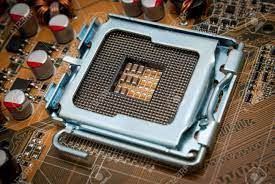
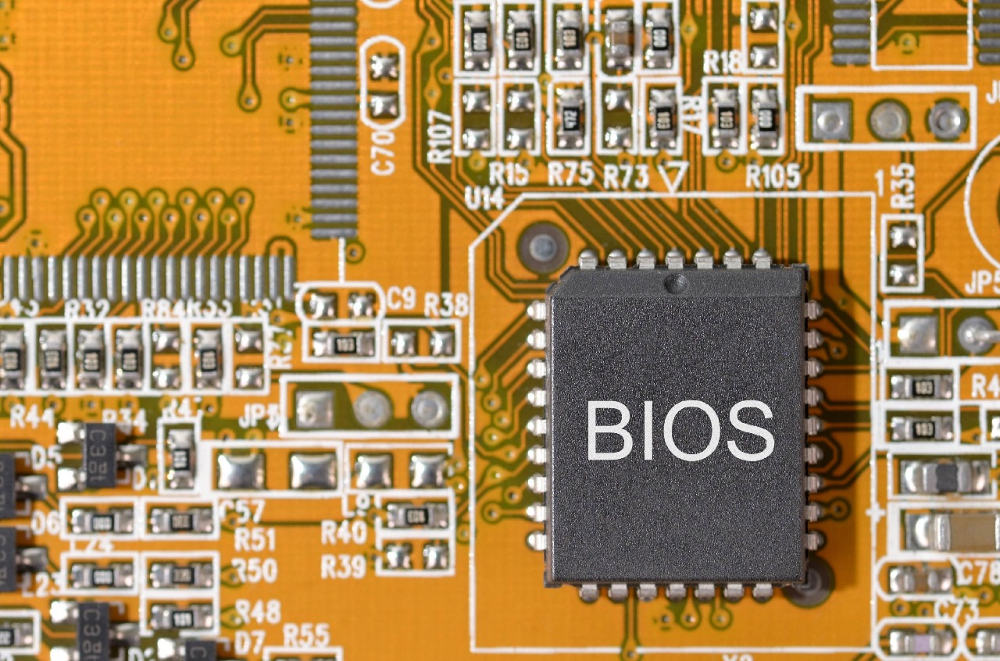
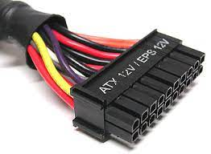
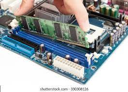

1. [Komposisi Motherboard](#Komposisi-Motherboard)
2. [Perbedaan Legacy&UEFI](#Perbedaan-Legacy&UEFI)

# Komposisi Motherboard
1. *Socket CPU*: Ada ZIF (Zero Insertion Force), LIF (Low Insertion Force), dan AMD Socket A.

2. *BIOS (Basic Input-Output System)*: Program dasar yang menghubungkan motherboard dengan sistem operasi.

3. *North Bridge Controller*: Menghubungkan slot RAM, AGP, dan socket CPU.

4. *South Bridge Controller*: Mengatur peripheral seperti USB, keyboard, IDE controller, dll.

5. *Konektor Power Supply Unit*: Menyambungkan motherboard dengan power supply, AT atau ATX.

6. *Slot RAM*: Tempat meletakkan RAM, saat ini menggunakan tipe DDR3.

7. *Slot PCI*: Tempat untuk Add-on Card seperti LAN, sound, dan TV Tuner.

8. *Slot AGP (Accelerated Graphics Port)*: Untuk AGP Card yang menampilkan grafis.

9. *Slot IDE dan SATA*: IDE untuk harddisk atau floppy disk, SATA untuk serial ATA.

10. *CMOS (Complementary Metal Oxide Semiconductor)*: Baterai yang memberi daya pada memori untuk pengaturan konfigurasi.

# Perbedaan Legacy&UEFI

1. Definisi
Unified Extensible Firmware Interface (UEFI) adalah proses booting pada komputer modern dengan kemampuan lebih canggih dibanding sistem Legacy. UEFI menggunakan firmware URFI untuk menyimpan EFI Service Partitions saat proses booting berlangsung. 
Sementara, Legacy adalah proses booting komputer dengan firmware BIOS yang lebih lama dan tradisional. 
2. Waktu yang Dibutuhkan
UEFI membutuhkan waktu booting yang lebih cepat. Sedangkan, Legacy lebih lama. 
3. Dukungan untuk Penyimpanan
UEFI sudah menggunakan partisi GUID Partition Table (GTP), sehingga dapat mendukung perangkat penyimpanan hingga 9 zettabytes. 
Legacy yang masih menggunakan dukungan Master Boot Record (MBR) dapat mendukung perangkat penyimpanan komputer hanya 2 TB. 
4. Keamanan
UEFI dapat mencegah pemuatan aplikasi yang tak sah atau dicurigai. Selain itu juga dapat menghambat adanya kerja dua boot karena UEFI menganggap sistem operasi adalah aplikasi. 
ADVERTISEMENT
Namun, pada Legacy, tak ada keamanan yang disediakan saat booting berlangsung, sehingga ada kemungkinan aplikasi tak sah dimuat serta terjadi dual-boot.
